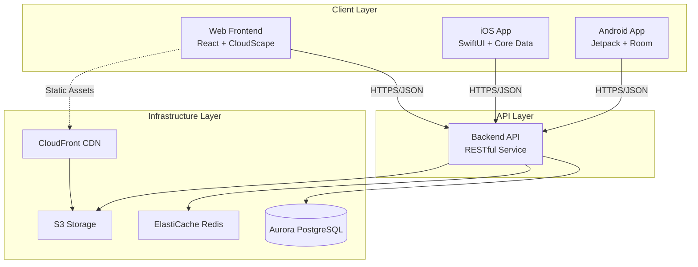
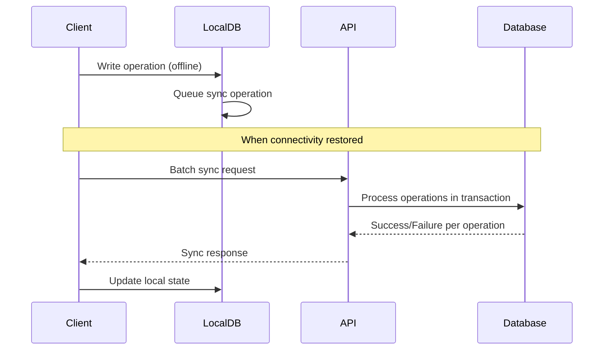

# Design Document: Community Activity Tracker System

## Overview

The Community Activity Tracker is a distributed, multi-platform system designed to help communities track, manage, and analyze their community-building activities. The system follows a microservices architecture with five independent packages that communicate through well-defined APIs.

### Design Philosophy

The design prioritizes:
- **Independence**: Each package can be developed, tested, and deployed independently
- **Offline-First**: All client applications function without connectivity
- **Consistency**: Single source of truth with eventual consistency across clients
- **Scalability**: Cloud-native architecture that scales with demand
- **Maintainability**: Clear separation of concerns and well-defined interfaces

### System Context

The system serves community organizers who need to:
- Track activities across multiple platforms (web, iOS, Android)
- Manage participant information and roles
- Analyze community engagement and growth
- Work offline in areas with poor connectivity
- Maintain data consistency across devices

## Architecture

### High-Level Architecture




### Package Architecture

The system is decomposed into five independent packages:

1. **Infrastructure Package**: AWS cloud resources provisioned via CDK
2. **Backend API Package**: Node.js/TypeScript RESTful API service
3. **Web Frontend Package**: React SPA with offline support
4. **iOS Mobile App Package**: Native Swift/SwiftUI application
5. **Android Mobile App Package**: Native Kotlin/Java application

**Design Rationale**: Package independence allows teams to work in parallel, deploy independently, and choose optimal technologies for each platform. This reduces coupling and increases development velocity.


### Communication Patterns

#### Client-to-Backend Communication

All client applications communicate with the Backend API using:
- **Protocol**: HTTPS with TLS 1.3
- **Format**: JSON request/response payloads
- **Authentication**: JWT tokens in Authorization header
- **API Style**: RESTful with resource-oriented endpoints

**Design Rationale**: REST over HTTPS is universally supported, well-understood, and provides good performance for mobile and web clients. JWT tokens enable stateless authentication that scales horizontally.

#### Synchronization Model

The system implements an optimistic, offline-first synchronization model:



**Design Rationale**: Optimistic updates provide immediate feedback to users. Batching reduces network overhead. Transactional processing ensures data consistency. Last-write-wins conflict resolution is simple and predictable.


## Components and Interfaces

### Package 1: Infrastructure

**Technology Stack**: AWS CDK (TypeScript), CloudFormation

**Key Components**:
- **Database**: Aurora PostgreSQL Serverless v2 with automatic scaling
- **API Hosting**: ECS Fargate for containerized API service
- **Frontend Hosting**: S3 + CloudFront for static web assets
- **Caching**: ElastiCache Redis for session and query caching
- **Monitoring**: CloudWatch for metrics, logs, and alarms
- **Secrets**: AWS Secrets Manager for credentials and API keys

**Design Decisions**:
- Aurora Serverless v2: Automatic scaling reduces costs during low usage
- ECS Fargate: Serverless containers eliminate infrastructure management
- CloudFront: Global CDN reduces latency for international users
- Multi-AZ deployment: High availability with automatic failover

**Interfaces**:
- Exports: Database endpoint, API endpoint, CloudFront distribution URL
- Configuration: Environment-specific parameters (dev, staging, prod)

### Package 2: Backend API

**Technology Stack**: Node.js 20, TypeScript, Express.js, Prisma ORM

**Key Components**:

#### API Router
- RESTful endpoint routing
- Request validation using Zod schemas
- OpenAPI 3.0 specification generation
- API versioning support (v1, v2, etc.)

#### Authentication Service
- JWT token generation and validation
- Password hashing with bcrypt
- Role-based access control (RBAC)
- Token refresh mechanism


#### Activity Service
- CRUD operations for activities
- Activity type management (predefined and custom)
- Status transitions (Planning → Active → Completed → Archived)
- Date validation for finite vs ongoing activities
- Venue association management with temporal tracking

#### Participant Service
- CRUD operations for participants
- Role assignment and management
- Participant-activity associations
- Duplicate detection
- Home address tracking with Type 2 SCD

#### Venue Service
- CRUD operations for venues
- Geographic area association validation
- Search by name or address
- Activity and participant association queries
- Referential integrity enforcement

#### Geographic Area Service
- CRUD operations for geographic areas
- Hierarchical relationship management
- Circular relationship prevention
- Ancestor and descendant queries
- Statistics aggregation across hierarchy

#### Analytics Engine
- Comprehensive engagement metrics with temporal analysis (activities/participants at start/end of date range, activities started/completed/cancelled)
- Multi-dimensional grouping (activity type, venue, geographic area, date with weekly/monthly/quarterly/yearly granularity)
- Flexible filtering (point filters and range filters)
- Growth data aggregation (new activities, activity trends)
- Time-series data generation
- Geographic filtering and breakdown
- Hierarchical statistics calculation
- Caching of computed metrics

#### Synchronization Service
- Batch operation processing
- Conflict resolution (last-write-wins)
- Transaction management
- Sync state tracking per client

**Design Decisions**:
- Prisma ORM: Type-safe database access with automatic migrations
- Express.js: Mature, well-supported framework with extensive middleware
- Zod validation: Runtime type checking that matches TypeScript types
- Service layer pattern: Business logic separated from HTTP concerns

**API Endpoints**:
```
POST   /api/v1/auth/login
POST   /api/v1/auth/refresh
GET    /api/v1/activities
POST   /api/v1/activities
GET    /api/v1/activities/:id
PUT    /api/v1/activities/:id
DELETE /api/v1/activities/:id
GET    /api/v1/activities/:id/venues
POST   /api/v1/activities/:id/venues
DELETE /api/v1/activities/:id/venues/:venueId
GET    /api/v1/participants
POST   /api/v1/participants
GET    /api/v1/participants/:id
PUT    /api/v1/participants/:id
DELETE /api/v1/participants/:id
GET    /api/v1/participants/:id/address-history
GET    /api/v1/venues
POST   /api/v1/venues
GET    /api/v1/venues/:id
PUT    /api/v1/venues/:id
DELETE /api/v1/venues/:id
GET    /api/v1/venues/search
GET    /api/v1/venues/:id/activities
GET    /api/v1/venues/:id/participants
GET    /api/v1/geographic-areas
POST   /api/v1/geographic-areas
GET    /api/v1/geographic-areas/:id
PUT    /api/v1/geographic-areas/:id
DELETE /api/v1/geographic-areas/:id
GET    /api/v1/geographic-areas/:id/children
GET    /api/v1/geographic-areas/:id/ancestors
GET    /api/v1/geographic-areas/:id/venues
GET    /api/v1/geographic-areas/:id/statistics
POST   /api/v1/sync/batch
GET    /api/v1/analytics/engagement
GET    /api/v1/analytics/growth
GET    /api/v1/analytics/geographic
GET    /api/v1/analytics/growth
```


### Package 3: Web Frontend

**Technology Stack**: React 18, TypeScript, CloudScape Design System, IndexedDB, Vite, Leaflet/Mapbox

**Key Components**:

#### UI Components
- Activity list and detail views
- Participant management interface
- Venue management interface
- Geographic area management with hierarchical tree view
- Interactive map view with venue markers and filtering
- Analytics dashboards with charts and geographic breakdown
- Authentication forms
- Offline status indicator

#### State Management
- React Context for global state
- TanStack Query for server state caching
- IndexedDB for offline persistence
- Optimistic updates for immediate feedback

#### Offline Manager
- Service Worker for offline functionality
- Background sync queue
- Conflict detection and resolution UI
- Network status monitoring

#### API Client
- Type-safe API calls using generated types
- Automatic retry with exponential backoff
- Request/response interceptors for auth
- Batch synchronization

#### Map Integration
- Leaflet or Mapbox GL JS for interactive maps
- Venue marker rendering with clustering
- Activity information popups
- Geographic area boundary overlays
- Filter controls for map display

**Design Decisions**:
- CloudScape: AWS-native design system ensures consistency
- IndexedDB: Browser-native storage with good performance
- Service Worker: Standard PWA approach for offline support
- TanStack Query: Sophisticated caching reduces API calls
- Leaflet/Mapbox: Industry-standard mapping libraries with good performance

**Routing Structure**:
```
/login
/dashboard
/activities
/activities/:id
/activities/new
/participants
/participants/:id
/participants/new
/venues
/venues/:id
/venues/new
/geographic-areas
/geographic-areas/:id
/geographic-areas/new
/map
/analytics
/settings
```


### Package 4: iOS Mobile App

**Technology Stack**: Swift 5.9, SwiftUI, Core Data, Combine, MapKit

**Key Components**:

#### Views
- Activity list and detail screens
- Participant management screens
- Venue management screens
- Geographic area management with hierarchical list
- Interactive map view using MapKit
- Analytics visualizations with geographic filtering
- Authentication screens
- Settings and sync status

#### Core Data Stack
- Local SQLite database
- Entity models matching API schema
- Background context for sync operations
- Persistent store coordinator

#### Network Layer
- URLSession-based API client
- Codable for JSON serialization
- JWT token management in Keychain
- Reachability monitoring

#### Sync Manager
- Background sync using BackgroundTasks framework
- Operation queue for pending changes
- Conflict resolution logic
- Sync state persistence

#### Map Integration
- MapKit for native iOS maps
- Venue annotations with custom styling
- Activity information callouts
- User location support
- Map region management

**Design Decisions**:
- SwiftUI: Modern, declarative UI framework
- Core Data: Apple's recommended persistence framework
- Combine: Reactive programming for async operations
- Keychain: Secure credential storage
- MapKit: Native iOS mapping with excellent performance

**Navigation Structure**:
```
TabView
├── Activities Tab
│   ├── Activity List
│   └── Activity Detail
├── Participants Tab
│   ├── Participant List
│   └── Participant Detail
├── Venues Tab
│   ├── Venue List
│   └── Venue Detail
├── Geographic Areas Tab
│   ├── Geographic Area List
│   └── Geographic Area Detail
├── Map Tab
│   └── Interactive Map View
├── Analytics Tab
│   └── Charts and Metrics
└── Settings Tab
    └── Sync Status and Preferences
```


### Package 5: Android Mobile App

**Technology Stack**: Kotlin, Jetpack Compose, Room, WorkManager, Retrofit, Google Maps SDK

**Key Components**:

#### UI Layer
- Composable screens for activities and participants
- Venue management screens
- Geographic area management with hierarchical list
- Interactive map view using Google Maps SDK
- Material Design 3 components
- Navigation component for screen flow
- ViewModel for UI state management

#### Data Layer
- Room database for local persistence
- Repository pattern for data access
- Flow-based reactive streams
- DataStore for preferences

#### Network Layer
- Retrofit for REST API calls
- Moshi for JSON serialization
- OkHttp interceptors for auth
- ConnectivityManager for network status

#### Sync Layer
- WorkManager for background sync
- Periodic and one-time work requests
- Constraint-based execution (network available)
- Conflict resolution logic

#### Map Integration
- Google Maps SDK for Android
- Custom marker rendering with clustering
- Activity information windows
- User location support
- Map camera management

**Design Decisions**:
- Jetpack Compose: Modern, declarative UI toolkit
- Room: Type-safe SQLite abstraction
- WorkManager: Reliable background task execution
- Material Design 3: Latest Android design guidelines
- Google Maps SDK: Industry-standard mapping for Android

**Navigation Graph**:
```
NavHost
├── Login Screen
├── Home Screen
├── Activity List Screen
├── Activity Detail Screen
├── Participant List Screen
├── Participant Detail Screen
├── Venue List Screen
├── Venue Detail Screen
├── Geographic Area List Screen
├── Geographic Area Detail Screen
├── Map Screen
├── Analytics Screen
└── Settings Screen
```


## Geographic Architecture

### Venue and Location Management

The system implements a comprehensive geographic tracking system that enables location-based analytics and visualization:

**Venue Model**:
- Represents physical locations (public buildings or private residences)
- Contains address information and optional coordinates
- Associated with a geographic area for hierarchical organization
- Supports temporal tracking for both activity locations and participant home addresses

**Geographic Area Hierarchy**:
- Recursive parent-child relationships enable multi-level geographic organization
- Supports standard types (neighbourhood, city, county, state, country) and custom types
- Enables reporting at any level of geographic granularity
- Statistics aggregate from leaf nodes up through the hierarchy

**Temporal Tracking**:
- **Type 2 SCD for Participant Addresses**: Maintains complete history of participant home address changes with effective date ranges
- **Activity-Venue Associations**: Tracks venue changes for activities over time, supporting activities that move locations

### Map Visualization

All client applications provide interactive map views:

**Web Frontend**:
- Uses Leaflet or Mapbox GL JS for web-based mapping
- Responsive design for desktop and tablet
- Marker clustering for dense areas
- Custom marker styling based on activity type/status

**iOS Mobile App**:
- Uses MapKit for native iOS mapping
- Custom annotation views with activity information
- User location support with privacy controls
- Smooth animations and gestures

**Android Mobile App**:
- Uses Google Maps SDK for Android
- Custom marker rendering with info windows
- User location support with permission handling
- Material Design 3 styled map controls

**Common Map Features**:
- Venue markers at coordinates
- Activity information on marker selection
- Filtering by activity type, status, and date range
- Geographic area boundary overlays (when available)
- Centering on specific venues or areas
- Participant home address display (with privacy controls)

### Geographic Analytics

The analytics engine supports comprehensive temporal analysis, multi-dimensional grouping, and flexible filtering:

**Temporal Analysis**:
- Activities at start and end of date ranges (existing activities)
- Activities started, completed, and cancelled within date ranges (activity lifecycle events)
- Participants at start and end of date ranges (active participants)
- All metrics provided in aggregate and broken down by activity type

**Multi-Dimensional Grouping**:
- Group by activity type: Compare different types of activities
- Group by venue: Analyze engagement at specific locations
- Group by geographic area: Hierarchical geographic analysis
- Group by date: Weekly, monthly, quarterly, or yearly time periods
- Multiple dimensions: Hierarchical organization (e.g., by geographic area, then by activity type, then by date)

**Flexible Filtering**:
- Point filters: Activity type, venue, geographic area (includes descendants)
- Range filters: Date ranges with start and end dates
- Multiple filters: Applied using AND logic for precise queries
- All-time metrics: Calculate across entire dataset when no date range specified

**Geographic Filtering**:
- All analytics queries accept optional geographic area filter
- Filtering includes the specified area and all descendants
- Enables comparison across different geographic regions
- Hierarchical drill-down from parent to child areas

**Geographic Breakdown**:
- Engagement metrics grouped by geographic area
- Activity and participant counts per area
- Role distribution within geographic segments
- Visualization in charts and on maps

**Design Rationale**: The enhanced analytics system enables sophisticated queries like "Show me monthly engagement metrics for each activity type in the downtown area, broken down by venue" or "Compare quarterly participant growth across all geographic areas." This flexibility supports diverse reporting needs while maintaining performance through efficient aggregation strategies. Geographic tracking enables community organizers to understand spatial patterns in community engagement, identify underserved areas, and allocate resources effectively. The hierarchical model provides flexibility for different community structures (urban vs rural, large vs small).


## Data Models

### Shared Data Models

All packages implement equivalent representations of these core entities:

#### User
```typescript
interface User {
  id: string;              // UUID
  email: string;           // Unique, validated email
  passwordHash: string;    // bcrypt hash (backend only)
  name: string;
  systemRole: SystemRole;  // Administrator | Editor | ReadOnly
  createdAt: Date;
  updatedAt: Date;
}

enum SystemRole {
  Administrator = "Administrator",
  Editor = "Editor",
  ReadOnly = "ReadOnly"
}
```

#### Activity
```typescript
interface Activity {
  id: string;              // UUID
  name: string;
  description: string;
  activityType: ActivityType;
  status: ActivityStatus;
  startDate: Date;
  endDate: Date | null;    // null for ongoing activities
  isOngoing: boolean;
  createdBy: string;       // User ID
  createdAt: Date;
  updatedAt: Date;
  version: number;         // For optimistic locking
}

interface ActivityType {
  id: string;
  name: string;
  isPredefined: boolean;
  createdAt: Date;
}

enum ActivityStatus {
  Planning = "Planning",
  Active = "Active",
  Completed = "Completed",
  Archived = "Archived"
}
```


#### Participant
```typescript
interface Participant {
  id: string;              // UUID
  name: string;
  email: string | null;
  phone: string | null;
  notes: string;
  homeVenueId: string | null;
  createdAt: Date;
  updatedAt: Date;
  version: number;
}

interface ParticipantRole {
  id: string;
  name: string;            // Tutor, Teacher, Animator, Host, Participant, etc.
  isPredefined: boolean;
  createdAt: Date;
}

interface ParticipantAddressHistory {
  id: string;
  participantId: string;
  venueId: string;
  venue: Venue;
  effectiveFrom: Date;
}
```

#### Venue
```typescript
interface Venue {
  id: string;              // UUID
  name: string;
  address: string;
  geographicAreaId: string;
  geographicArea: GeographicArea;
  latitude: number | null;
  longitude: number | null;
  venueType: VenueType | null;
  createdAt: Date;
  updatedAt: Date;
}

enum VenueType {
  PublicBuilding = "PUBLIC_BUILDING",
  PrivateResidence = "PRIVATE_RESIDENCE"
}
```

#### GeographicArea
```typescript
interface GeographicArea {
  id: string;              // UUID
  name: string;
  areaType: GeographicAreaType;
  parentGeographicAreaId: string | null;
  parent: GeographicArea | null;
  children: GeographicArea[];
  createdAt: Date;
  updatedAt: Date;
}

enum GeographicAreaType {
  Neighbourhood = "NEIGHBOURHOOD",
  Community = "COMMUNITY",
  City = "CITY",
  Cluster = "CLUSTER",
  County = "COUNTY",
  Province = "PROVINCE",
  State = "STATE",
  Country = "COUNTRY",
  Custom = "CUSTOM"
}

interface GeographicAreaStatistics {
  geographicAreaId: string;
  totalActivities: number;
  totalParticipants: number;
  activeActivities: number;
  ongoingActivities: number;
}
```

#### Activity
```typescript
interface Activity {
  id: string;              // UUID
  name: string;
  description: string;
  activityType: ActivityType;
  status: ActivityStatus;
  startDate: Date;
  endDate: Date | null;    // null for ongoing activities
  isOngoing: boolean;
  venues: ActivityVenueHistory[];
  createdBy: string;       // User ID
  createdAt: Date;
  updatedAt: Date;
  version: number;         // For optimistic locking
}

interface ActivityVenueHistory {
  id: string;
  activityId: string;
  venueId: string;
  venue: Venue;
  effectiveFrom: Date;
}
```

#### ActivityParticipant (Join Table)
```typescript
interface ActivityParticipant {
  id: string;
  activityId: string;
  participantId: string;
  role: ParticipantRole;
  joinedAt: Date;
  notes: string;
}
```

#### Analytics Models
```typescript
interface EngagementMetrics {
  totalActivities: number;
  activeActivities: number;
  totalParticipants: number;
  activeParticipants: number;
  participationRate: number;
  retentionRate: number;
  averageActivitySize: number;
  geographicBreakdown: GeographicEngagement[];
  periodStart: Date;
  periodEnd: Date;
}

interface GeographicEngagement {
  geographicAreaId: string;
  geographicAreaName: string;
  activityCount: number;
  participantCount: number;
}

interface GrowthData {
  date: Date;
  newActivities: number;
  cumulativeParticipants: number;
  cumulativeActivities: number;
}
```


#### Synchronization Models
```typescript
interface SyncOperation {
  id: string;
  entityType: string;      // "Activity" | "Participant" | "ActivityParticipant"
  entityId: string;
  operation: string;       // "CREATE" | "UPDATE" | "DELETE"
  data: any;               // Entity data
  timestamp: Date;
  clientId: string;        // Unique client identifier
  version: number;         // Entity version for conflict detection
}

interface SyncState {
  clientId: string;
  lastSyncTimestamp: Date;
  pendingOperations: number;
  conflictCount: number;
}
```

**Design Rationale**: 
- UUIDs enable distributed ID generation without coordination
- Version numbers support optimistic locking and conflict detection
- Nullable endDate distinguishes finite from ongoing activities
- Separate type and role tables allow predefined and custom values
- Timestamps enable time-based queries and audit trails

### Database Schema (Backend)

The PostgreSQL database implements these models with additional constraints:

```sql
-- Users table with authentication
CREATE TABLE users (
  id UUID PRIMARY KEY DEFAULT gen_random_uuid(),
  email VARCHAR(255) UNIQUE NOT NULL,
  password_hash VARCHAR(255) NOT NULL,
  name VARCHAR(255) NOT NULL,
  system_role VARCHAR(50) NOT NULL,
  created_at TIMESTAMP NOT NULL DEFAULT NOW(),
  updated_at TIMESTAMP NOT NULL DEFAULT NOW()
);

-- Activity types (predefined and custom)
CREATE TABLE activity_types (
  id UUID PRIMARY KEY DEFAULT gen_random_uuid(),
  name VARCHAR(255) UNIQUE NOT NULL,
  is_predefined BOOLEAN NOT NULL DEFAULT false,
  created_at TIMESTAMP NOT NULL DEFAULT NOW()
);

-- Activities
CREATE TABLE activities (
  id UUID PRIMARY KEY DEFAULT gen_random_uuid(),
  name VARCHAR(255) NOT NULL,
  description TEXT,
  activity_type_id UUID REFERENCES activity_types(id),
  status VARCHAR(50) NOT NULL,
  start_date DATE NOT NULL,
  end_date DATE,
  is_ongoing BOOLEAN NOT NULL DEFAULT false,
  created_by UUID REFERENCES users(id),
  created_at TIMESTAMP NOT NULL DEFAULT NOW(),
  updated_at TIMESTAMP NOT NULL DEFAULT NOW(),
  version INTEGER NOT NULL DEFAULT 1
);

-- Participants
CREATE TABLE participants (
  id UUID PRIMARY KEY DEFAULT gen_random_uuid(),
  name VARCHAR(255) NOT NULL,
  email VARCHAR(255),
  phone VARCHAR(50),
  notes TEXT,
  created_at TIMESTAMP NOT NULL DEFAULT NOW(),
  updated_at TIMESTAMP NOT NULL DEFAULT NOW(),
  version INTEGER NOT NULL DEFAULT 1
);

-- Participant roles
CREATE TABLE participant_roles (
  id UUID PRIMARY KEY DEFAULT gen_random_uuid(),
  name VARCHAR(255) UNIQUE NOT NULL,
  is_predefined BOOLEAN NOT NULL DEFAULT false,
  created_at TIMESTAMP NOT NULL DEFAULT NOW()
);

-- Activity-Participant associations
CREATE TABLE activity_participants (
  id UUID PRIMARY KEY DEFAULT gen_random_uuid(),
  activity_id UUID REFERENCES activities(id) ON DELETE CASCADE,
  participant_id UUID REFERENCES participants(id) ON DELETE CASCADE,
  role_id UUID REFERENCES participant_roles(id),
  joined_at TIMESTAMP NOT NULL DEFAULT NOW(),
  notes TEXT,
  UNIQUE(activity_id, participant_id)
);

-- Indexes for performance
CREATE INDEX idx_activities_status ON activities(status);
CREATE INDEX idx_activities_created_by ON activities(created_by);
CREATE INDEX idx_activities_dates ON activities(start_date, end_date);
CREATE INDEX idx_participants_email ON participants(email);
CREATE INDEX idx_activity_participants_activity ON activity_participants(activity_id);
CREATE INDEX idx_activity_participants_participant ON activity_participants(participant_id);
```


## Correctness Properties

*A property is a characteristic or behavior that should hold true across all valid executions of a system—essentially, a formal statement about what the system should do. Properties serve as the bridge between human-readable specifications and machine-verifiable correctness guarantees.*

### Property 1: Data Consistency Across Platforms

*For any* entity (Activity, Participant, ActivityParticipant) created or modified on any client platform, after successful synchronization, querying that entity from any other platform should return the same data.

**Validates: Requirements 1.4, 4.2, 4.3**

### Property 2: Offline Operation Preservation

*For any* sequence of create, update, or delete operations performed while offline, when connectivity is restored and synchronization completes, the final state should be equivalent to performing those operations while online.

**Validates: Requirements 5.1, 5.2, 5.3**

### Property 3: Authentication Token Validity

*For any* valid JWT token issued by the authentication service, all API endpoints should accept that token until expiration, and reject it after expiration.

**Validates: Requirements 6.1, 6.3**

### Property 4: Role-Based Access Control

*For any* user with ReadOnly role, all mutation operations (POST, PUT, DELETE) should be rejected with 403 Forbidden, while all query operations (GET) should succeed.

**Validates: Requirements 6.2**

### Property 5: Activity Date Validation

*For any* finite activity (isOngoing = false), the endDate must be greater than or equal to startDate, and for any ongoing activity (isOngoing = true), endDate must be null.

**Validates: Requirements (implicit from data model)**


### Property 6: Synchronization Idempotence

*For any* sync operation, applying it multiple times should produce the same result as applying it once (idempotent behavior).

**Validates: Requirements 5.3, 5.4**

### Property 7: Conflict Resolution Consistency

*For any* two conflicting updates to the same entity from different clients, the last-write-wins strategy should consistently select the update with the latest timestamp across all clients after synchronization.

**Validates: Requirements 4.4, 5.4**

### Property 8: API Contract Compliance

*For any* API request that conforms to the OpenAPI specification, the API should process it successfully, and for any request that violates the specification, the API should reject it with appropriate error codes.

**Validates: Requirements 7.2**

### Property 9: Analytics Calculation Accuracy

*For any* time period, the cumulative participant count at period end should equal the total number of unique participants who have been assigned to activities up to that point.

**Validates: Requirements (implicit from analytics functionality)**

### Property 10: Cascade Deletion Integrity

*For any* activity that is deleted, all associated ActivityParticipant records should also be deleted, maintaining referential integrity.

**Validates: Requirements (implicit from data model)**

### Property 11: Venue Geographic Area Association

*For any* venue created or updated, it must be associated with a valid geographic area, and the geographic area must exist in the system.

**Validates: Requirements 7A.2, 7A.3**

### Property 12: Venue Deletion Prevention

*For any* venue referenced by activities or participants, attempting to delete it should fail and return an error explaining which entities reference it.

**Validates: Requirements 7A.8**

### Property 13: Geographic Area Hierarchy Validity

*For any* geographic area, if it has a parent geographic area, the parent must exist and must not create a circular relationship (area cannot be its own ancestor).

**Validates: Requirements 7B.4, 7B.5**

### Property 14: Geographic Area Deletion Prevention

*For any* geographic area referenced by venues or child geographic areas, attempting to delete it should fail and return an error.

**Validates: Requirements 7B.7**

### Property 15: Geographic Hierarchy Navigation

*For any* geographic area, retrieving its ancestors should return the complete path from the area to the root, and retrieving its descendants should return all child areas recursively.

**Validates: Requirements 7B.6**

### Property 16: Geographic Statistics Aggregation

*For any* geographic area, the calculated statistics should include activity and participant counts for the area itself and all its descendants in the hierarchy.

**Validates: Requirements 7B.8**

### Property 17: Participant Address History Temporal Consistency

*For any* participant with multiple address history records, no two records should have the same effectiveFrom date, and the most recent record (by effectiveFrom) represents the current address.

**Validates: Requirements 7A.5**

### Property 18: Activity Venue Association Temporal Tracking

*For any* activity with venue associations, the venue history should track all venue changes over time with effective start dates, where the most recent record represents the current venue.

**Validates: Requirements 7A.6, 7A.7**

### Property 19: Map Marker Display Accuracy

*For any* venue with valid latitude and longitude coordinates, a marker should be displayed on the map at those exact coordinates in all client applications.

**Validates: Requirements 7C.2**

### Property 20: Map Marker Activity Information

*For any* venue marker selected on the map, the displayed information should include all activities currently or historically associated with that venue.

**Validates: Requirements 7C.3**

### Property 21: Map Filter Application

*For any* filter criteria (activity type, status, or date range) applied to the map view, only venues with activities matching the criteria should display markers.

**Validates: Requirements 7C.5**

### Property 22: Geographic Area Filter Cascading

*For any* analytics query with a geographic area filter, the results should include data from the specified area and all its descendants in the hierarchy.

**Validates: Requirements 7B.8**


## Error Handling

### Error Categories

#### Client Errors (4xx)
- **400 Bad Request**: Invalid request format or validation failure
- **401 Unauthorized**: Missing or invalid authentication token
- **403 Forbidden**: Insufficient permissions for operation
- **404 Not Found**: Requested resource does not exist
- **409 Conflict**: Version conflict during optimistic locking

#### Server Errors (5xx)
- **500 Internal Server Error**: Unexpected server-side error
- **503 Service Unavailable**: Database or dependent service unavailable

### Error Response Format

All API errors return consistent JSON structure:

```typescript
interface ErrorResponse {
  error: {
    code: string;           // Machine-readable error code
    message: string;        // Human-readable error message
    details?: any;          // Additional error context
    timestamp: Date;
    requestId: string;      // For debugging and support
  }
}
```

### Error Handling Strategies

#### Backend API
- Validate all inputs using Zod schemas before processing
- Catch and log all exceptions with request context
- Return appropriate HTTP status codes
- Never expose internal implementation details in errors
- Use correlation IDs for distributed tracing

#### Client Applications
- Display user-friendly error messages
- Retry transient errors with exponential backoff
- Queue operations when offline
- Show sync status and conflict resolution UI
- Log errors for debugging (with user consent)


### Offline Error Handling

When clients are offline:
1. Queue all mutations in local database
2. Display "Offline" indicator in UI
3. Show pending sync count
4. Automatically retry when connectivity restored
5. Handle sync failures gracefully with user notification

### Conflict Resolution

When version conflicts occur:
1. Backend detects version mismatch
2. Returns 409 Conflict with current server state
3. Client presents conflict resolution UI
4. User chooses: keep local, keep server, or merge
5. Client resubmits with updated version

**Design Rationale**: Explicit conflict resolution gives users control over their data. Last-write-wins is the default for automatic resolution, but users can override when conflicts are detected.

## Testing Strategy

### Dual Testing Approach

The system employs both unit testing and property-based testing:

- **Unit Tests**: Verify specific examples, edge cases, and error conditions
- **Property Tests**: Verify universal properties across all inputs

Both approaches are complementary and necessary for comprehensive coverage. Unit tests catch concrete bugs in specific scenarios, while property tests verify general correctness across the input space.

### Unit Testing

**Backend API**:
- Jest for test framework
- Supertest for HTTP endpoint testing
- Test database with Docker for integration tests
- Mock external dependencies (AWS services)

**Web Frontend**:
- Vitest for test framework
- React Testing Library for component tests
- MSW (Mock Service Worker) for API mocking
- Playwright for end-to-end tests

**iOS Mobile App**:
- XCTest for unit and UI tests
- Quick/Nimble for BDD-style tests
- Mock Core Data stack for data layer tests

**Android Mobile App**:
- JUnit 5 for unit tests
- Espresso for UI tests
- Room in-memory database for data layer tests
- MockK for mocking


### Property-Based Testing

**Framework Selection**:
- **Backend API**: fast-check (TypeScript/JavaScript)
- **Web Frontend**: fast-check (TypeScript/JavaScript)
- **iOS Mobile App**: SwiftCheck (Swift)
- **Android Mobile App**: Kotest Property Testing (Kotlin)

**Configuration**:
- Minimum 100 iterations per property test
- Each test tagged with feature name and property number
- Tag format: `Feature: community-activity-tracker, Property {N}: {property_text}`

**Property Test Examples**:

```typescript
// Backend API - Property 1: Data Consistency
test('Property 1: Data consistency across platforms', async () => {
  await fc.assert(
    fc.asyncProperty(
      activityArbitrary(),
      async (activity) => {
        // Create activity via API
        const created = await api.post('/activities', activity);
        
        // Retrieve from API
        const retrieved = await api.get(`/activities/${created.id}`);
        
        // Should match
        expect(retrieved).toEqual(created);
      }
    ),
    { numRuns: 100 }
  );
});

// Backend API - Property 5: Activity Date Validation
test('Property 5: Activity date validation', () => {
  fc.assert(
    fc.property(
      activityArbitrary(),
      (activity) => {
        if (!activity.isOngoing) {
          // Finite activities must have endDate >= startDate
          expect(activity.endDate).toBeGreaterThanOrEqual(activity.startDate);
        } else {
          // Ongoing activities must have null endDate
          expect(activity.endDate).toBeNull();
        }
      }
    ),
    { numRuns: 100 }
  );
});
```

**Design Rationale**: Property-based testing with 100+ iterations provides high confidence in correctness across the input space. Fast-check and equivalent libraries generate diverse test cases automatically, catching edge cases that manual tests might miss.


### Integration Testing

Each package includes integration tests:

**Infrastructure**:
- CDK synthesis tests
- Stack deployment validation
- Resource connectivity tests

**Backend API**:
- End-to-end API workflow tests
- Database migration tests
- Authentication flow tests
- Synchronization scenario tests

**Client Applications**:
- Offline-to-online transition tests
- Sync conflict resolution tests
- Multi-device synchronization tests
- Authentication and authorization flows

### Test Coverage Goals

- Unit test coverage: 80% minimum
- Property test coverage: All correctness properties
- Integration test coverage: All critical user workflows
- End-to-end test coverage: Happy path and major error scenarios

## Security Considerations

### Authentication and Authorization

**JWT Token Structure**:
```typescript
interface JWTPayload {
  sub: string;           // User ID
  email: string;
  systemRole: SystemRole;
  iat: number;           // Issued at
  exp: number;           // Expiration (24 hours)
}
```

**Token Lifecycle**:
1. User logs in with email/password
2. Backend validates credentials
3. Backend issues JWT with 24-hour expiration
4. Client stores token securely (Keychain/EncryptedSharedPreferences/localStorage)
5. Client includes token in Authorization header
6. Backend validates token on each request
7. Client refreshes token before expiration


### Data Protection

**Encryption in Transit**:
- TLS 1.3 for all HTTPS connections
- Certificate pinning in mobile apps
- HSTS headers for web application

**Encryption at Rest**:
- Aurora PostgreSQL encryption enabled
- S3 bucket encryption enabled
- Mobile device encryption (iOS/Android platform-level)

**Sensitive Data Handling**:
- Passwords hashed with bcrypt (cost factor 12)
- JWT secrets stored in AWS Secrets Manager
- Database credentials rotated regularly
- No sensitive data in logs or error messages

### Input Validation

All user inputs validated at multiple layers:
1. Client-side validation for immediate feedback
2. API request validation using Zod schemas
3. Database constraints for data integrity
4. Parameterized queries to prevent SQL injection

### Rate Limiting

API endpoints protected with rate limiting:
- Authentication endpoints: 5 requests per minute per IP
- Mutation endpoints: 100 requests per minute per user
- Query endpoints: 1000 requests per minute per user

**Design Rationale**: Rate limiting prevents abuse and DoS attacks while allowing legitimate usage patterns.

## Performance Considerations

### Backend API Performance

**Caching Strategy**:
- Redis cache for frequently accessed data
- Cache TTL: 5 minutes for analytics, 1 minute for entities
- Cache invalidation on mutations
- Cache warming for common queries

**Database Optimization**:
- Indexes on foreign keys and frequently queried fields
- Connection pooling (max 20 connections)
- Query optimization with EXPLAIN ANALYZE
- Pagination for large result sets (default 50 items)


### Client Performance

**Web Frontend**:
- Code splitting by route
- Lazy loading of components
- Image optimization and lazy loading
- Service Worker caching of static assets
- Virtual scrolling for large lists

**Mobile Apps**:
- Lazy loading of data
- Image caching and compression
- Background sync to avoid blocking UI
- Efficient Core Data/Room queries
- Memory management for large datasets

### Scalability

**Horizontal Scaling**:
- ECS Fargate auto-scaling based on CPU/memory
- Aurora read replicas for query scaling
- CloudFront edge caching for static assets
- Stateless API design enables easy scaling

**Vertical Scaling**:
- Aurora Serverless v2 auto-scales capacity
- ElastiCache cluster mode for Redis scaling

**Design Rationale**: Serverless and auto-scaling technologies reduce operational overhead while providing elastic capacity. Stateless API design enables horizontal scaling without session affinity concerns.

## Monitoring and Observability

### Metrics

**Infrastructure Metrics**:
- ECS task CPU and memory utilization
- Aurora database connections and query performance
- API response times and error rates
- CloudFront cache hit ratio

**Application Metrics**:
- API endpoint latency (p50, p95, p99)
- Request count by endpoint and status code
- Authentication success/failure rates
- Sync operation success/failure rates
- Active user count


### Logging

**Log Levels**:
- ERROR: Unhandled exceptions and critical failures
- WARN: Handled errors and degraded functionality
- INFO: Important business events (login, sync, etc.)
- DEBUG: Detailed diagnostic information (dev/staging only)

**Log Structure**:
```typescript
interface LogEntry {
  timestamp: Date;
  level: string;
  message: string;
  requestId: string;
  userId?: string;
  metadata?: any;
}
```

**Log Aggregation**:
- CloudWatch Logs for centralized logging
- Log retention: 30 days for INFO, 90 days for ERROR
- Log insights for querying and analysis

### Alerting

**Critical Alerts** (PagerDuty):
- API error rate > 5%
- Database connection failures
- Authentication service unavailable
- Sync failure rate > 10%

**Warning Alerts** (Email):
- API latency p95 > 1 second
- Database CPU > 80%
- Cache hit ratio < 70%
- Disk space > 80%

**Design Rationale**: Proactive monitoring and alerting enable rapid response to issues before they impact users. Structured logging facilitates debugging and root cause analysis.

## Deployment Strategy

### Environment Progression

1. **Development**: Individual developer testing with local resources
2. **Staging**: Integration testing with production-like infrastructure
3. **Production**: Live user environment with full monitoring


### Deployment Process

**Infrastructure**:
```bash
# Deploy infrastructure stack
cd infrastructure
npm run deploy:dev
npm run deploy:staging
npm run deploy:prod
```

**Backend API**:
```bash
# Build and deploy API
cd backend-api
npm run build
npm run deploy:dev
npm run deploy:staging
npm run deploy:prod
```

**Web Frontend**:
```bash
# Build and deploy web app
cd web-frontend
npm run build
npm run deploy:dev
npm run deploy:staging
npm run deploy:prod
```

**Mobile Apps**:
- iOS: TestFlight for staging, App Store for production
- Android: Internal testing track for staging, Production track for production

### CI/CD Pipeline

**Continuous Integration**:
1. Code pushed to Git repository
2. GitHub Actions triggered
3. Run linting and type checking
4. Run unit tests and property tests
5. Run integration tests
6. Build artifacts

**Continuous Deployment**:
1. Merge to main branch
2. Deploy to staging environment
3. Run smoke tests
4. Manual approval for production
5. Deploy to production
6. Run smoke tests
7. Monitor metrics

**Design Rationale**: Automated CI/CD reduces deployment risk and enables rapid iteration. Staging environment provides production-like testing before release.


### Rollback Strategy

Each package maintains independent versioning:

**Infrastructure**: 
- CDK stack versioning
- CloudFormation change sets for preview
- Rollback via CloudFormation stack update

**Backend API**:
- Semantic versioning (major.minor.patch)
- Blue-green deployment with ECS
- Instant rollback by switching traffic

**Web Frontend**:
- Build versioning
- CloudFront invalidation for updates
- Rollback by deploying previous build

**Mobile Apps**:
- App store versioning
- Phased rollout (10% → 50% → 100%)
- Rollback by releasing previous version

## Migration Strategy

### Database Migrations

**Prisma Migrations**:
```bash
# Create migration
npx prisma migrate dev --name add_activity_types

# Apply to staging
npx prisma migrate deploy --preview-feature

# Apply to production
npx prisma migrate deploy
```

**Migration Best Practices**:
- Always backward compatible
- Test on staging before production
- Include rollback scripts
- Monitor performance impact
- Schedule during low-traffic periods

### Data Migration

For existing data:
1. Export from legacy system
2. Transform to new schema
3. Validate data integrity
4. Import to staging
5. Test thoroughly
6. Import to production
7. Verify and monitor


## Future Enhancements

### Phase 2 Features

**Real-time Collaboration**:
- WebSocket support for live updates
- Presence indicators (who's viewing/editing)
- Collaborative editing with operational transforms

**Advanced Analytics**:
- Predictive analytics for participant retention
- Trend analysis and forecasting
- Custom report builder
- Data export (CSV, PDF)

**Enhanced Offline Support**:
- Conflict resolution strategies beyond last-write-wins
- Offline-first architecture improvements
- Peer-to-peer sync between devices

**Integration Capabilities**:
- Calendar integration (Google Calendar, Outlook)
- Email notifications and reminders
- Slack/Teams integration
- Webhook support for external systems

### Technical Debt Considerations

**Known Limitations**:
- Last-write-wins may lose data in rare conflict scenarios
- No real-time updates (polling required)
- Limited analytics customization
- No bulk import/export functionality

**Planned Improvements**:
- GraphQL API for flexible queries
- Server-sent events for real-time updates
- Advanced caching strategies
- Performance optimization for large datasets

## Conclusion

This design provides a solid foundation for the Community Activity Tracker system. The distributed architecture with independent packages enables parallel development, flexible deployment, and technology optimization per platform. The offline-first approach ensures usability in all connectivity scenarios, while the synchronization model maintains data consistency across devices.

Key design decisions prioritize:
- **Developer Experience**: Clear separation of concerns, type safety, modern frameworks
- **User Experience**: Offline support, responsive design, consistent cross-platform functionality
- **Operational Excellence**: Monitoring, logging, automated deployment, scalability
- **Correctness**: Property-based testing, comprehensive error handling, data validation

The system is designed to scale from small communities to large organizations while maintaining simplicity and maintainability.
