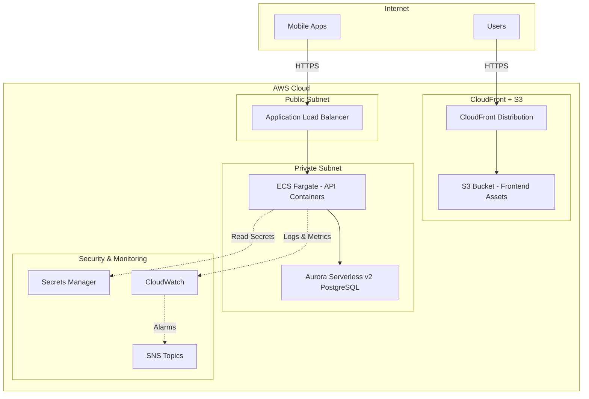

# Design Document: Infrastructure Package

## Overview

The Infrastructure package implements a complete AWS cloud infrastructure using Infrastructure as Code (IaC) principles with AWS CDK and TypeScript. The design provides a scalable, secure, and cost-effective hosting environment for the Community Activity Tracker system across multiple deployment environments (dev, staging, production).

The infrastructure follows AWS best practices for security, reliability, and operational excellence. It uses managed services to minimize operational overhead while maintaining flexibility for scaling and customization.

## Architecture

### High-Level Architecture



### Design Rationale

**Managed Services First**: The design prioritizes AWS managed services (Aurora Serverless, ECS Fargate, CloudFront) to reduce operational complexity and maintenance burden. This allows the team to focus on application development rather than infrastructure management.

**Security by Default**: All resources are deployed with security best practices - private subnets for databases, encryption at rest and in transit, least-privilege security groups, and secrets management through AWS Secrets Manager.

**Multi-Environment Support**: The CDK stack design uses context parameters to support multiple environments with different configurations, enabling safe testing and gradual rollout of changes.

**Cost Optimization**: Aurora Serverless v2 provides automatic scaling to minimize costs during low-usage periods, while CloudFront caching reduces origin requests and data transfer costs.

## Components and Interfaces

### 1. CDK Application Structure

**Main CDK App** (`bin/infrastructure.ts`)
- Entry point for CDK application
- Reads environment configuration from CDK context
- Instantiates environment-specific stacks
- Manages stack dependencies

**Infrastructure Stack** (`lib/infrastructure-stack.ts`)
- Main stack containing all infrastructure resources
- Accepts environment configuration as constructor parameters
- Orchestrates creation of all components
- Exports outputs for cross-stack references

**Environment Configuration**
```typescript
interface EnvironmentConfig {
  environmentName: string;  // dev, staging, production
  vpcCidr: string;
  databaseConfig: DatabaseConfig;
  apiConfig: ApiConfig;
  frontendConfig: FrontendConfig;
  monitoringConfig: MonitoringConfig;
}
```

### 2. Networking Layer

**VPC Component**
- Creates VPC with configurable CIDR block
- Provisions public subnets (2 AZs) for load balancers
- Provisions private subnets (2 AZs) for application and database
- Configures NAT Gateways for private subnet internet access
- Enables VPC Flow Logs to CloudWatch

**Security Groups**
- `DatabaseSecurityGroup`: Allows PostgreSQL (5432) from API security group only
- `ApiSecurityGroup`: Allows HTTPS (443) from ALB security group
- `AlbSecurityGroup`: Allows HTTPS (443) from internet (0.0.0.0/0)

**Design Rationale**: Multi-AZ deployment ensures high availability. Private subnets for database and application tiers prevent direct internet access, following defense-in-depth principles.

### 3. Database Layer

**Aurora Serverless v2 Cluster**
- PostgreSQL-compatible database engine
- Deployed in private subnets across 2 AZs
- Auto-scaling configuration:
  - Min capacity: 0.5 ACU (dev), 1 ACU (staging), 2 ACU (production)
  - Max capacity: 2 ACU (dev), 4 ACU (staging), 16 ACU (production)
- Automated backups with 7-day retention
- Point-in-time recovery enabled
- Encryption at rest using AWS-managed KMS keys

**Database Credentials**
- Generated automatically by CDK
- Stored in AWS Secrets Manager
- Automatic rotation enabled (30-day cycle)
- Secret ARN exported for API access

**Design Rationale**: Aurora Serverless v2 provides automatic scaling based on workload, eliminating the need for manual capacity planning. The serverless model is cost-effective for variable workloads while maintaining PostgreSQL compatibility.

### 4. API Hosting Layer

**ECS Fargate Cluster**
- Serverless container orchestration
- No EC2 instance management required
- Task definition configuration:
  - CPU: 256 (dev), 512 (staging), 1024 (production)
  - Memory: 512 MB (dev), 1 GB (staging), 2 GB (production)
  - Container image from ECR
  - Environment variables for configuration
  - Secrets injection from Secrets Manager

**Application Load Balancer**
- Deployed in public subnets
- HTTPS listener with ACM certificate
- Health check configuration:
  - Path: `/health`
  - Interval: 30 seconds
  - Timeout: 5 seconds
  - Healthy threshold: 2
  - Unhealthy threshold: 3

**Auto-Scaling Configuration**
- Target tracking scaling policies:
  - CPU utilization target: 70%
  - Memory utilization target: 80%
- Min tasks: 1 (dev), 2 (staging), 3 (production)
- Max tasks: 3 (dev), 6 (staging), 20 (production)

**Design Rationale**: ECS Fargate eliminates server management while providing container orchestration. The ALB provides SSL termination and health checking. Auto-scaling ensures the API can handle traffic spikes while minimizing costs during low-usage periods.

### 5. Frontend Hosting Layer

**S3 Bucket**
- Private bucket for static assets
- Versioning enabled for rollback capability
- Lifecycle policies:
  - Transition to Intelligent-Tiering after 30 days
  - Delete old versions after 90 days
- Server-side encryption enabled

**CloudFront Distribution**
- Origin: S3 bucket via Origin Access Identity
- SSL/TLS: ACM certificate for custom domain
- Cache behaviors:
  - HTML files: Cache for 5 minutes (frequent updates)
  - JS/CSS/Images: Cache for 1 year (content-hashed filenames)
  - Default: Cache for 1 hour
- Compression: Gzip and Brotli enabled
- Security headers via Lambda@Edge:
  - Strict-Transport-Security
  - X-Content-Type-Options
  - X-Frame-Options
  - Content-Security-Policy

**SPA Routing Configuration**
- Custom error responses:
  - 404 → /index.html (200 status)
  - 403 → /index.html (200 status)
- Enables client-side routing for React SPA

**Design Rationale**: CloudFront provides global content delivery with low latency. Aggressive caching for static assets reduces origin requests and costs. Security headers protect against common web vulnerabilities.

### 6. Secrets Management

**AWS Secrets Manager Integration**
- Database credentials secret (auto-generated)
- API configuration secrets (manually created)
- Automatic rotation for database credentials
- KMS encryption for all secrets
- IAM policies grant ECS tasks read-only access

**Secret Structure**
```typescript
interface DatabaseSecret {
  username: string;
  password: string;
  host: string;
  port: number;
  dbname: string;
  engine: string;
}
```

**Design Rationale**: Secrets Manager provides secure storage with automatic rotation, eliminating hardcoded credentials. Integration with ECS allows containers to retrieve secrets at runtime without exposing them in environment variables.

### 7. Monitoring and Alerting

**CloudWatch Dashboards**
- API Metrics Dashboard:
  - Request count and latency (p50, p95, p99)
  - Error rate and status code distribution
  - ECS task count and resource utilization
- Database Metrics Dashboard:
  - Connection count and query latency
  - CPU and memory utilization
  - Storage usage and IOPS
- Frontend Metrics Dashboard:
  - CloudFront request count and cache hit rate
  - Error rate by status code
  - Data transfer volume

**CloudWatch Alarms**
- API latency > 2 seconds (p95) for 2 consecutive periods
- API error rate > 5% for 2 consecutive periods
- Database connection failures > 10 in 5 minutes
- ECS task count < minimum desired count
- Aurora ACU utilization > 90% for 5 minutes

**SNS Topics**
- Critical alarms topic (production)
- Warning alarms topic (all environments)
- Email subscriptions configured per environment

**CloudWatch Logs**
- Log groups for each service:
  - `/aws/ecs/api-{environment}`
  - `/aws/rds/aurora-{environment}`
  - `/aws/vpc/flowlogs-{environment}`
- Retention: 7 days (dev), 30 days (staging), 90 days (production)

**Design Rationale**: Comprehensive monitoring enables proactive issue detection. Separate alarm topics allow different notification strategies for different severity levels. Log aggregation simplifies troubleshooting.

### 8. Resource Tagging Strategy

**Standard Tags Applied to All Resources**
```typescript
{
  Environment: string;      // dev, staging, production
  Application: string;      // community-activity-tracker
  CostCenter: string;       // engineering
  Owner: string;            // devops-team
  ManagedBy: string;        // cdk
  Project: string;          // community-tracker
}
```

**Implementation via CDK Aspects**
- Tags applied automatically to all resources in stack
- Enforced through CDK aspects for consistency
- Used for cost allocation and resource management

**Design Rationale**: Consistent tagging enables cost tracking, resource organization, and automated operations. CDK aspects ensure tags are applied uniformly without manual intervention.

## Data Models

### CDK Stack Configuration

**Environment Context** (`cdk.json`)
```typescript
{
  "dev": {
    "account": "123456789012",
    "region": "us-east-1",
    "vpcCidr": "10.0.0.0/16",
    "database": {
      "minCapacity": 0.5,
      "maxCapacity": 2
    },
    "api": {
      "cpu": 256,
      "memory": 512,
      "minTasks": 1,
      "maxTasks": 3
    },
    "domainName": "dev.communitytracker.example.com"
  },
  "staging": { /* ... */ },
  "production": { /* ... */ }
}
```

### Infrastructure Outputs

**Stack Exports**
- `VpcId`: VPC identifier for cross-stack references
- `DatabaseSecretArn`: Secret ARN for database credentials
- `ApiEndpoint`: ALB DNS name for API access
- `FrontendUrl`: CloudFront distribution URL
- `FrontendBucketName`: S3 bucket name for deployment
- `EcsClusterName`: ECS cluster name for service deployment

## Correctness Properties

*A property is a characteristic or behavior that should hold true across all valid executions of a system—essentially, a formal statement about what the system should do. Properties serve as the bridge between human-readable specifications and machine-verifiable correctness guarantees.*

### Property 1: Environment Isolation

*For any* two different environments (dev, staging, production), the infrastructure resources SHALL be completely isolated with no shared networking or data access between them.

**Validates: Requirements 6.3**

### Property 2: Database Network Isolation

*For any* database instance provisioned by the infrastructure, the database SHALL only be accessible from within the VPC private subnets and SHALL NOT have any public IP address or internet gateway route.

**Validates: Requirements 7.2**

### Property 3: Secret Encryption

*For any* secret stored in AWS Secrets Manager, the secret SHALL be encrypted at rest using KMS and SHALL NOT be accessible without proper IAM permissions.

**Validates: Requirements 8.4**

### Property 4: Resource Tagging Completeness

*For any* AWS resource created by the CDK stack, the resource SHALL have all required tags (Environment, Application, CostCenter, Owner, ManagedBy) applied.

**Validates: Requirements 12.1, 12.2, 12.3, 12.4**

### Property 5: Multi-AZ Deployment

*For any* critical infrastructure component (database, ECS tasks, load balancer), the component SHALL be deployed across at least 2 availability zones for high availability.

**Validates: Requirements 10.3**

### Property 6: HTTPS Enforcement

*For any* public-facing endpoint (ALB, CloudFront), the endpoint SHALL enforce HTTPS and SHALL redirect HTTP requests to HTTPS.

**Validates: Requirements 4.3, 3.6**

### Property 7: Backup Configuration

*For any* Aurora database cluster, automated backups SHALL be enabled with a retention period of at least 7 days and point-in-time recovery SHALL be enabled.

**Validates: Requirements 2.4, 10.1, 10.2**

### Property 8: Security Group Least Privilege

*For any* security group created by the infrastructure, the ingress rules SHALL only allow traffic from specific source security groups or CIDR blocks, never from 0.0.0.0/0 except for the ALB security group.

**Validates: Requirements 7.3**

### Property 9: CloudWatch Alarm Coverage

*For any* critical metric (API latency, error rate, database connections), there SHALL exist a corresponding CloudWatch alarm configured with appropriate thresholds and SNS notification.

**Validates: Requirements 5.2, 5.3, 5.4**

### Property 10: CDK Synthesis Validity

*For any* environment configuration, running `cdk synth` SHALL produce valid CloudFormation templates without errors and SHALL include all required resources.

**Validates: Requirements 1.3, 1.5**

## Error Handling

### CDK Deployment Errors

**Stack Creation Failures**
- CDK automatically rolls back failed stack creation
- CloudFormation events logged to console and CloudWatch
- Failed resources identified in stack events
- Manual cleanup may be required for resources created outside CDK

**Stack Update Failures**
- CDK performs changeset validation before deployment
- Failed updates automatically roll back to previous state
- Replacement resources created before deletion (zero-downtime updates)
- Manual intervention required if rollback fails

**Resource Limit Errors**
- VPC limit, EIP limit, or other AWS service limits
- CDK deployment fails with descriptive error message
- Resolution: Request limit increase through AWS Support
- Temporary workaround: Deploy to different region or account

### Runtime Infrastructure Errors

**Database Connection Failures**
- ECS tasks retry database connections with exponential backoff
- CloudWatch alarm triggers after 10 failures in 5 minutes
- SNS notification sent to operations team
- Auto-scaling may provision additional tasks if connection pool exhausted

**ECS Task Failures**
- Failed tasks automatically replaced by ECS service scheduler
- CloudWatch alarm triggers if task count drops below minimum
- Task logs captured in CloudWatch for debugging
- Health check failures trigger task replacement

**ALB Health Check Failures**
- Unhealthy targets removed from load balancer rotation
- ECS service scheduler provisions replacement tasks
- CloudWatch alarm triggers if all targets unhealthy
- Traffic routed only to healthy targets

**CloudFront Origin Errors**
- 5xx errors from S3 origin cached for minimal duration (10 seconds)
- Custom error pages served for 404/403 errors
- CloudWatch metrics track error rates
- Alarm triggers if error rate exceeds threshold

### Security and Access Errors

**IAM Permission Denied**
- ECS tasks fail to start if unable to retrieve secrets
- CloudWatch logs capture permission denied errors
- Resolution: Update IAM role policies to grant required permissions
- Deployment validation should catch permission issues before production

**Secrets Manager Access Failures**
- ECS tasks fail to start if secrets unavailable
- Automatic retry with exponential backoff
- CloudWatch alarm triggers after repeated failures
- Resolution: Verify secret exists and IAM permissions are correct

**KMS Encryption Errors**
- Database or secrets operations fail if KMS key unavailable
- CloudWatch logs capture KMS errors
- Resolution: Verify KMS key policy allows access from service
- Automatic retry for transient KMS service issues

### Monitoring and Alerting Errors

**CloudWatch Alarm State Errors**
- Alarms enter INSUFFICIENT_DATA state if metrics unavailable
- SNS notification sent when alarm state changes
- Resolution: Verify metric is being published correctly
- Check CloudWatch Logs for service errors

**SNS Notification Failures**
- Failed email deliveries logged in CloudWatch
- Retry with exponential backoff for transient failures
- Resolution: Verify email subscriptions are confirmed
- Check SNS topic policies allow alarm publication

## Testing Strategy

### Unit Testing

Unit tests verify specific CDK constructs and configurations work correctly in isolation.

**CDK Construct Tests**
- Test individual stack components (VPC, database, ECS cluster)
- Verify resource properties match expected configuration
- Test environment-specific configuration variations
- Validate IAM policies grant correct permissions
- Use CDK assertions library for CloudFormation template validation

**Example Test Cases**:
- Database cluster has encryption enabled
- Security groups have correct ingress rules
- ECS task definition has correct environment variables
- CloudFront distribution has correct cache behaviors
- All resources have required tags

**Testing Framework**: Jest with AWS CDK assertions library

### Property-Based Testing

Property tests verify universal properties hold across all infrastructure configurations and environments.

**Property Test Configuration**:
- Minimum 100 iterations per property test
- Generate random but valid environment configurations
- Test across all supported environments (dev, staging, production)
- Validate CloudFormation template structure and relationships

**Test Implementation**:
- Use fast-check library for property-based testing in TypeScript
- Generate random environment configurations within valid ranges
- Synthesize CDK stacks with generated configurations
- Assert properties hold for all generated configurations

### Integration Testing

**CDK Deployment Tests**
- Deploy test stacks to isolated AWS accounts
- Verify all resources created successfully
- Test cross-resource connectivity (ECS to database, ALB to ECS)
- Validate monitoring and alerting configuration
- Clean up test stacks after validation

**Infrastructure Validation**
- Run AWS Config rules to verify compliance
- Test database connectivity from ECS tasks
- Verify CloudFront serves content from S3
- Test auto-scaling triggers
- Validate backup and recovery procedures

### Manual Testing Checklist

**Pre-Deployment Validation**
- Review CDK diff output for unexpected changes
- Verify environment configuration in cdk.json
- Check AWS service limits for target account/region
- Confirm IAM permissions for deployment role

**Post-Deployment Validation**
- Verify all stack outputs are correct
- Test API endpoint connectivity
- Test frontend URL loads correctly
- Verify CloudWatch dashboards display metrics
- Test alarm notifications via SNS

**Disaster Recovery Testing**
- Restore database from backup
- Test point-in-time recovery
- Verify S3 bucket versioning and recovery
- Test stack deletion and recreation
- Document recovery time objectives (RTO) and recovery point objectives (RPO)

### Continuous Integration

**CI/CD Pipeline Integration**
- Run unit tests on every commit
- Run property tests on every pull request
- Synthesize CDK templates and check for drift
- Deploy to dev environment automatically on main branch
- Require manual approval for staging and production deployments

**Automated Validation**
- CDK diff comparison against deployed stacks
- CloudFormation template linting (cfn-lint)
- Security scanning (cfn-nag)
- Cost estimation for infrastructure changes
- Compliance validation against organizational policies
