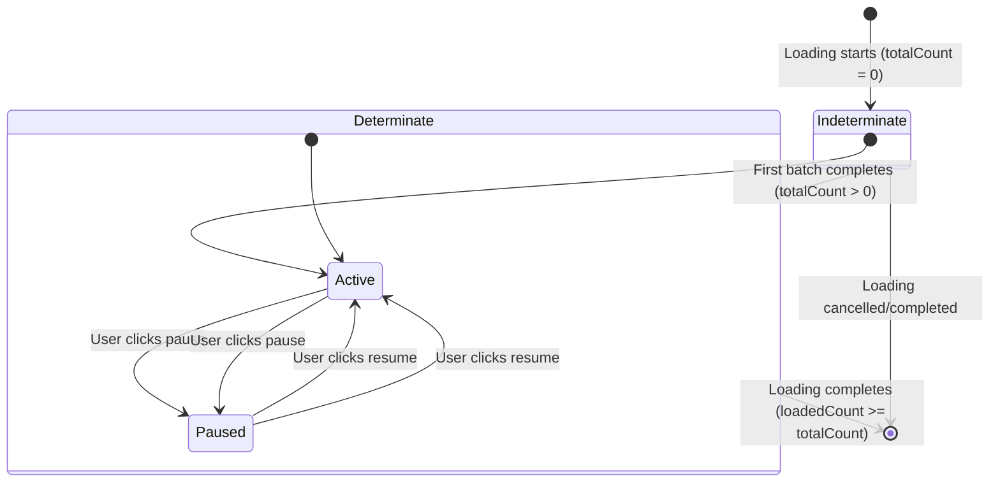

# Design Document: Map Loading Indeterminate Mode

## Overview

This design enhances the ProgressIndicator component to support two distinct loading modes: indeterminate and determinate. The enhancement addresses a user experience gap where no visual feedback is provided during the initial batch fetch on the Map View, when the total count of markers is unknown.

### Current State

The ProgressIndicator component currently:
- Only renders when `totalCount > 0`
- Displays a CloudScape ProgressBar with percentage and count information
- Supports pause/resume functionality via button controls
- Unmounts when loading completes (`loadedCount >= totalCount`)

### Problem

When map marker loading begins, the first batch fetch must complete before the total count is known. During this initial period (typically 1-2 seconds), users see no loading indicator, creating the perception that the application is unresponsive or frozen.

### Solution

Introduce an indeterminate loading mode that:
- Displays immediately when loading starts, regardless of total count
- Shows a CloudScape Spinner animation when total count is unknown
- Transitions smoothly to determinate mode (ProgressBar) when total count becomes available
- Maintains pause/resume functionality in both modes

### Design Goals

1. Provide immediate visual feedback when loading begins
2. Maintain visual consistency with existing CloudScape design system
3. Preserve all existing pause/resume functionality
4. Enable smooth transitions between loading modes
5. Minimize changes to parent components (MapViewPage, MapView)

## Architecture

### Component Structure

The ProgressIndicator component will use conditional rendering to switch between two display modes:

```
ProgressIndicator
├── Indeterminate Mode (totalCount === 0 or undefined)
│   ├── Pause/Resume Button
│   └── Spinner + Text Label
└── Determinate Mode (totalCount > 0)
    ├── Pause/Resume Button
    └── ProgressBar with counts
```

### Mode Determination Logic

```typescript
function determineMode(totalCount: number): 'indeterminate' | 'determinate' {
  return totalCount > 0 ? 'determinate' : 'indeterminate';
}
```

### State Flow



### Integration Points

1. **MapViewPage**: No changes required. Already passes `totalCount: 0` initially, which will trigger indeterminate mode.
2. **MapView.optimized**: No changes required. Already updates loading state via `onLoadingStateChange` callback.
3. **ProgressIndicator**: Primary modification point. Will handle both modes internally.

## Components and Interfaces

### ProgressIndicator Props Interface

```typescript
interface ProgressIndicatorProps {
  loadedCount: number;        // Current number of loaded items
  totalCount: number;         // Total items to load (0 = unknown)
  entityName: string;         // Display name for items (e.g., "markers")
  onCancel: () => void;       // Callback to pause loading
  onResume: () => void;       // Callback to resume loading
  isCancelled: boolean;       // Current pause state
}
```

**No changes to the interface** - the existing props already support both modes.

### CloudScape Components Used

1. **Spinner** (indeterminate mode)
   - Import: `@cloudscape-design/components/spinner`
   - Props: `size="normal"` for inline display
   - Automatically animates when rendered

2. **ProgressBar** (determinate mode)
   - Import: `@cloudscape-design/components/progress-bar`
   - Props: `value`, `additionalInfo`, `status`
   - Already in use

3. **Button** (both modes)
   - Import: `@cloudscape-design/components/button`
   - Icons: `pause` and `play`
   - Already in use

4. **SpaceBetween** (both modes)
   - Import: `@cloudscape-design/components/space-between`
   - Direction: `horizontal`, Size: `xs`
   - Already in use

### Rendering Logic

```typescript
export function ProgressIndicator({
  loadedCount,
  totalCount,
  entityName,
  onCancel,
  onResume,
  isCancelled,
}: ProgressIndicatorProps) {
  // Unmount when loading is complete
  if (loadedCount >= totalCount && totalCount > 0) {
    return null;
  }

  // Determine mode
  const mode = totalCount > 0 ? 'determinate' : 'indeterminate';

  // Render indeterminate mode
  if (mode === 'indeterminate') {
    return (
      <SpaceBetween direction="horizontal" size="xs">
        <Button
          iconName={isCancelled ? "play" : "pause"}
          onClick={isCancelled ? onResume : onCancel}
          ariaLabel={isCancelled ? `Resume loading ${entityName}` : "Pause loading"}
        />
        <Box display="flex" alignItems="center">
          {!isCancelled && <Spinner size="normal" />}
          <Box margin={{ left: "xs" }}>
            {isCancelled ? `Loading paused` : `Loading ${entityName}...`}
          </Box>
        </Box>
      </SpaceBetween>
    );
  }

  // Render determinate mode (existing logic)
  const progressPercentage = (loadedCount / totalCount) * 100;
  
  return (
    <SpaceBetween direction="horizontal" size="xs">
      <Button
        iconName={isCancelled ? "play" : "pause"}
        onClick={isCancelled ? onResume : onCancel}
        ariaLabel={isCancelled ? `Resume loading ${entityName}` : "Pause loading"}
      />
      <ProgressBar
        value={progressPercentage}
        additionalInfo={
          isCancelled
            ? `Loaded ${loadedCount} / ${totalCount} ${entityName}.`
            : `Loading ${loadedCount} / ${totalCount} ${entityName}...`
        }
        status="in-progress"
      />
    </SpaceBetween>
  );
}
```

## Data Models

### Loading State Type

```typescript
interface LoadingState {
  loadedCount: number;    // Number of items loaded so far
  totalCount: number;     // Total items to load (0 = unknown)
  isCancelled: boolean;   // Whether loading is paused
}
```

This type is already defined in MapViewPage and passed through the component hierarchy.

### Mode Enumeration

```typescript
type LoadingMode = 'indeterminate' | 'determinate';
```

This is a derived value, not stored in state. It's computed from `totalCount` on each render.

### Display Text Patterns

**Indeterminate Mode:**
- Active: `"Loading {entityName}..."` (e.g., "Loading markers...")
- Paused: `"Loading paused"`

**Determinate Mode:**
- Active: `"Loading {loadedCount} / {totalCount} {entityName}..."` (e.g., "Loading 50 / 200 markers...")
- Paused: `"Loaded {loadedCount} / {totalCount} {entityName}."` (e.g., "Loaded 50 / 200 markers.")


## Correctness Properties

*A property is a characteristic or behavior that should hold true across all valid executions of a system—essentially, a formal statement about what the system should do. Properties serve as the bridge between human-readable specifications and machine-verifiable correctness guarantees.*

### Property Reflection

After analyzing all acceptance criteria, I identified several redundant properties:
- Requirements 5.2, 5.3, and 5.4 duplicate the mode determination logic already covered by 1.1 and 2.1
- Requirement 4.4 is redundant with 4.1 (both test unmounting on completion)
- Requirements 3.1 and 3.2 can be combined into a single property about pause/resume button presence
- Requirements 3.3 and 3.4 can be combined into a single property about animation state based on pause status
- Requirements 1.2 and 1.3 can be combined into a single property about indeterminate mode rendering

The following properties represent the unique, testable behaviors after eliminating redundancy:

### Property 1: Mode determination based on total count

*For any* loading state, when totalCount is 0 or undefined, the component should render in indeterminate mode (showing Spinner and no count information), and when totalCount is greater than 0, the component should render in determinate mode (showing ProgressBar with count information).

**Validates: Requirements 1.1, 2.1, 5.2, 5.3, 5.4**

### Property 2: Indeterminate mode displays animation without counts

*For any* loading state in indeterminate mode (totalCount = 0) where isCancelled is false, the component should render a Spinner and text without percentage or count information (no "X / Y" pattern).

**Validates: Requirements 1.2, 1.3**

### Property 3: Determinate mode displays progress with counts

*For any* loading state in determinate mode (totalCount > 0), the component should render a ProgressBar with a value equal to (loadedCount / totalCount) * 100, and the text should contain both loadedCount and totalCount values.

**Validates: Requirements 2.2, 2.3**

### Property 4: Component renders during active loading

*For any* loading state where loading is not complete (loadedCount < totalCount OR totalCount = 0), the component should render content (not return null).

**Validates: Requirements 1.4**

### Property 5: Pause and resume buttons present in both modes

*For any* loading state in either mode, the component should render a button that calls onCancel when not paused and onResume when paused, with appropriate icons and labels.

**Validates: Requirements 3.1, 3.2, 3.5**

### Property 6: Animation state reflects pause status

*For any* loading state in indeterminate mode, the Spinner should be rendered when isCancelled is false and should not be rendered when isCancelled is true.

**Validates: Requirements 3.3, 3.4**

### Property 7: Paused state displays appropriate UI

*For any* loading state where isCancelled is true, the component should render a play button (not pause button) and display paused text.

**Validates: Requirements 4.2**

### Property 8: Component unmounts on completion

*For any* loading state where loadedCount >= totalCount AND totalCount > 0, the component should return null (unmount).

**Validates: Requirements 4.1, 4.4**

### Property 9: Consistent layout structure across modes

*For any* loading state in either mode, the component should use SpaceBetween with direction="horizontal" and size="xs" as the root container, ensuring consistent positioning.

**Validates: Requirements 6.3**

## Error Handling

### Invalid Props Handling

The component should handle edge cases gracefully:

1. **Negative counts**: If `loadedCount` or `totalCount` is negative, treat as 0
2. **LoadedCount exceeds totalCount**: Component should unmount (existing behavior)
3. **Undefined entityName**: Use empty string or default value
4. **Missing callbacks**: Component should not crash if onCancel/onResume are undefined (though TypeScript prevents this)

### Mode Transition Edge Cases

1. **Rapid totalCount changes**: Component should handle rapid updates without flickering
2. **TotalCount changes from positive to zero**: Should transition back to indeterminate mode (unlikely but possible)
3. **Completion during indeterminate mode**: If somehow loadedCount >= totalCount while totalCount = 0, component should remain visible (edge case 4.3)

### Pause State Consistency

1. **Pause during mode transition**: If user pauses during the transition from indeterminate to determinate, the paused state should be preserved
2. **Resume with no active loading**: If onResume is called but loading is already complete, component should handle gracefully

## Testing Strategy

### Dual Testing Approach

This feature requires both unit tests and property-based tests to ensure comprehensive coverage:

- **Unit tests**: Verify specific examples, mode transitions, and edge cases
- **Property tests**: Verify universal properties across all possible loading states

### Unit Testing Focus

Unit tests should cover:

1. **Specific mode examples**:
   - Indeterminate mode with totalCount = 0
   - Determinate mode with totalCount = 100, loadedCount = 50
   - Transition from indeterminate to determinate

2. **Edge cases**:
   - Loading completion (loadedCount = totalCount)
   - Paused state in both modes
   - Empty/zero counts
   - Rapid prop changes

3. **User interactions**:
   - Clicking pause button calls onCancel
   - Clicking resume button calls onResume
   - Button labels and icons are correct

4. **Component lifecycle**:
   - Component unmounts when complete
   - Component renders when loading starts
   - Component updates when props change

### Property-Based Testing Configuration

**Library**: Use `@fast-check/vitest` for TypeScript/React property-based testing

**Configuration**:
- Minimum 100 iterations per property test
- Each test must reference its design document property using the tag format

**Test Tag Format**:
```typescript
// Feature: map-loading-indeterminate-mode, Property 1: Mode determination based on total count
```

**Generator Strategy**:

Create arbitraries (generators) for:
```typescript
// Loading state generator
const loadingStateArb = fc.record({
  loadedCount: fc.nat({ max: 1000 }),
  totalCount: fc.nat({ max: 1000 }),
  isCancelled: fc.boolean(),
  entityName: fc.string({ minLength: 1, maxLength: 20 })
});

// Indeterminate state generator (totalCount = 0)
const indeterminateStateArb = fc.record({
  loadedCount: fc.nat({ max: 100 }),
  totalCount: fc.constant(0),
  isCancelled: fc.boolean(),
  entityName: fc.string({ minLength: 1, maxLength: 20 })
});

// Determinate state generator (totalCount > 0, loadedCount < totalCount)
const determinateStateArb = fc.record({
  loadedCount: fc.nat({ max: 100 }),
  totalCount: fc.integer({ min: 1, max: 1000 }),
  isCancelled: fc.boolean(),
  entityName: fc.string({ minLength: 1, maxLength: 20 })
}).filter(state => state.loadedCount < state.totalCount);
```

**Property Test Implementation**:

Each correctness property should be implemented as a single property-based test:

1. **Property 1**: Generate random loading states, verify mode determination logic
2. **Property 2**: Generate indeterminate states, verify Spinner presence and no count text
3. **Property 3**: Generate determinate states, verify ProgressBar value and count text
4. **Property 4**: Generate incomplete loading states, verify component renders
5. **Property 5**: Generate any loading state, verify button presence and callbacks
6. **Property 6**: Generate indeterminate states, verify Spinner based on isCancelled
7. **Property 7**: Generate paused states, verify play button and paused text
8. **Property 8**: Generate complete loading states, verify component returns null
9. **Property 9**: Generate any loading state, verify SpaceBetween container structure

### Test File Organization

```
web-frontend/src/components/common/__tests__/
├── ProgressIndicator.test.tsx           # Existing unit tests (update)
└── ProgressIndicator.property.test.tsx  # New property-based tests
```

### Existing Test Updates

The existing unit tests in `ProgressIndicator.test.tsx` need updates:

1. **Update "should not render when totalCount is 0" test**: This test expects no render, but now the component should render in indeterminate mode
2. **Add indeterminate mode tests**: New tests for Spinner rendering, indeterminate text
3. **Add mode transition tests**: Tests for switching from indeterminate to determinate
4. **Update pause/resume tests**: Ensure they work in both modes

### Integration Testing

While not part of this component's test suite, integration tests should verify:

1. MapViewPage correctly initializes with totalCount = 0
2. MapView.optimized correctly updates totalCount after first batch
3. ProgressIndicator correctly responds to loading state changes from parent
4. End-to-end flow: start loading → indeterminate mode → first batch → determinate mode → completion

