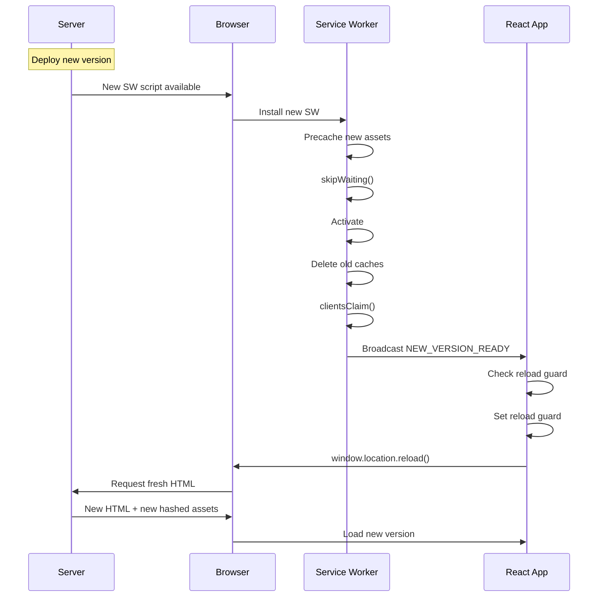
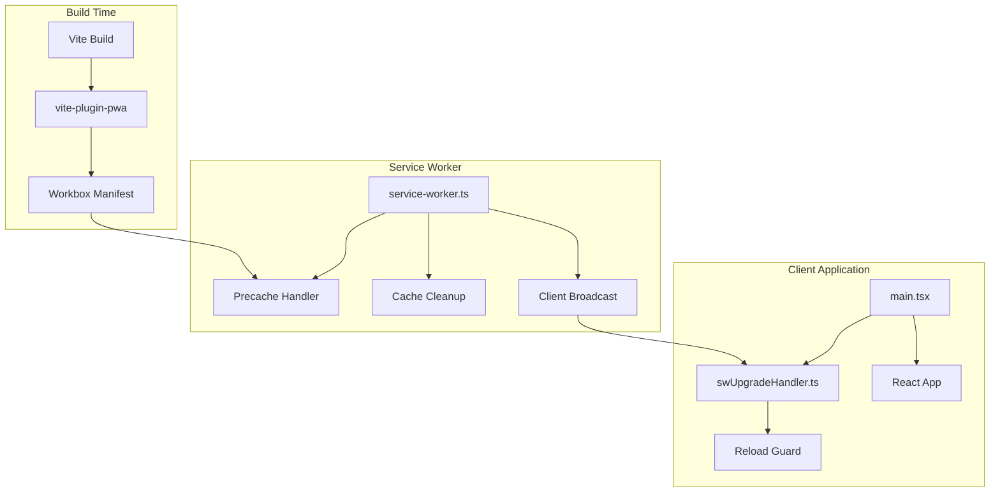

# Design Document: SPA Atomic Upgrade System

## Overview

This design implements a production-grade atomic version upgrade system for a React 18 SPA using Vite, TypeScript, and Service Workers with Workbox. The system guarantees that deployments are atomic—no client ever runs a partially stale bundle, and deleted hashed chunks never cause runtime 404 failures.

The core strategy relies on:
1. **Immediate service worker activation** using skipWaiting() and clientsClaim()
2. **Complete precaching** of all build assets via Workbox manifest
3. **Aggressive cache deletion** during activation to eliminate stale assets
4. **Broadcast notifications** to all open tabs when a new version activates
5. **Single-reload guarantee** per tab using session storage guards
6. **Content-hashed assets** with proper HTTP cache headers

This eliminates the need for chunk retry logic and allows safe deletion of old assets server-side immediately after deployment.

## Architecture

### High-Level Flow



### Component Architecture



## Components and Interfaces

### 1. Service Worker (service-worker.ts)

**Purpose**: Manages asset caching, activation, and client notifications.

**Key Responsibilities**:
- Precache all build assets from Workbox manifest
- Activate immediately using skipWaiting()
- Take control of all clients using clientsClaim()
- Delete old caches during activation
- Broadcast upgrade notifications to all clients

**TypeScript Interface**:

```typescript
// Service Worker Global Scope
declare const self: ServiceWorkerGlobalScope;

// Workbox manifest injection point
declare const __WB_MANIFEST: Array<{
  url: string;
  revision: string | null;
}>;

interface UpgradeMessage {
  type: 'NEW_VERSION_READY';
}
```

**Implementation Pseudocode**:

```
IMPORT clientsClaim FROM 'workbox-core'
IMPORT precacheAndRoute FROM 'workbox-precaching'

// Immediate activation
CALL self.skipWaiting()
CALL clientsClaim()

// Precache all build assets
CALL precacheAndRoute(__WB_MANIFEST)

// Listen for activation
ON 'activate' EVENT:
  // Delete old caches
  cacheNames = AWAIT caches.keys()
  FOR EACH cacheName IN cacheNames:
    IF cacheName NOT IN [workbox-precache, workbox-runtime]:
      AWAIT caches.delete(cacheName)
  
  // Broadcast to all clients
  clients = AWAIT self.clients.matchAll({ type: 'window' })
  FOR EACH client IN clients:
    client.postMessage({ type: 'NEW_VERSION_READY' })
```

### 2. Upgrade Handler (swUpgradeHandler.ts)

**Purpose**: Listens for service worker upgrade notifications and triggers page reload with loop protection.

**Key Responsibilities**:
- Listen for service worker messages
- Check reload guard before reloading
- Set reload guard in session storage
- Trigger window reload exactly once per tab

**TypeScript Interface**:

```typescript
interface ServiceWorkerMessage {
  type: string;
  [key: string]: unknown;
}

interface UpgradeHandler {
  register(): void;
  handleUpgrade(): void;
  shouldReload(): boolean;
  markReloaded(): void;
}
```

**Implementation Pseudocode**:

```
CONST RELOAD_FLAG = 'app-version-reload'

FUNCTION shouldReload():
  RETURN sessionStorage.getItem(RELOAD_FLAG) === null

FUNCTION markReloaded():
  sessionStorage.setItem(RELOAD_FLAG, 'true')

FUNCTION handleUpgrade():
  IF shouldReload():
    markReloaded()
    window.location.reload()

FUNCTION register():
  IF NOT navigator.serviceWorker:
    RETURN
  
  // Listen for messages from service worker
  navigator.serviceWorker.addEventListener('message', (event) => {
    IF event.data.type === 'NEW_VERSION_READY':
      handleUpgrade()
  })
  
  // Listen for controller changes
  navigator.serviceWorker.addEventListener('controllerchange', () => {
    // Controller changed, new SW is active
    // Message should arrive shortly
  })

EXPORT register
```

### 3. Service Worker Registration (main.tsx)

**Purpose**: Register the service worker and initialize upgrade handler on application startup.

**Implementation Pseudocode**:

```
IMPORT { registerSWUpgradeHandler } FROM './swUpgradeHandler'

FUNCTION registerServiceWorker():
  IF 'serviceWorker' NOT IN navigator:
    RETURN
  
  IF import.meta.env.PROD:
    TRY:
      registration = AWAIT navigator.serviceWorker.register('/sw.js')
      console.log('Service Worker registered:', registration)
    CATCH error:
      console.error('Service Worker registration failed:', error)

// Register SW and upgrade handler before React renders
AWAIT registerServiceWorker()
registerSWUpgradeHandler()

// Then render React
createRoot(document.getElementById('root')!).render(...)
```

### 4. Vite Configuration (vite.config.ts)

**Purpose**: Configure build output with content-hashed filenames and integrate Workbox.

**Key Configuration**:
- Content-hashed filenames for all assets
- Workbox plugin for manifest generation
- Service worker compilation from TypeScript

**Implementation Pseudocode**:

```
IMPORT { defineConfig } FROM 'vite'
IMPORT react FROM '@vitejs/plugin-react'
IMPORT { VitePWA } FROM 'vite-plugin-pwa'

EXPORT DEFAULT defineConfig({
  plugins: [
    react(),
    VitePWA({
      strategies: 'injectManifest',
      srcDir: 'src',
      filename: 'service-worker.ts',
      injectManifest: {
        globPatterns: ['**/*.{js,css,html,ico,png,svg,json}']
      },
      devOptions: {
        enabled: false  // Disable in dev to avoid confusion
      }
    })
  ],
  build: {
    rollupOptions: {
      output: {
        entryFileNames: 'assets/[name].[hash].js',
        chunkFileNames: 'assets/[name].[hash].js',
        assetFileNames: 'assets/[name].[hash].[ext]'
      }
    }
  }
})
```

### 5. HTTP Cache Headers Configuration

**Purpose**: Ensure HTML is always fresh and assets are safely long-lived.

**Server Configuration** (example for nginx):

```
# index.html - always fresh
location = /index.html {
  add_header Cache-Control "no-cache";
}

# Hashed assets - long-lived
location ~* \.(js|css|png|jpg|jpeg|gif|ico|svg|woff|woff2|ttf|eot)$ {
  add_header Cache-Control "public, max-age=31536000, immutable";
}
```

**For AWS CloudFront**:

```json
{
  "PathPattern": "/index.html",
  "CacheBehavior": {
    "MinTTL": 0,
    "DefaultTTL": 0,
    "MaxTTL": 0
  }
}
```

```json
{
  "PathPattern": "/assets/*",
  "CacheBehavior": {
    "MinTTL": 31536000,
    "DefaultTTL": 31536000,
    "MaxTTL": 31536000
  }
}
```

## Data Models

### Service Worker Message Format

```typescript
interface ServiceWorkerMessage {
  type: 'NEW_VERSION_READY';
}
```

### Workbox Manifest Entry

```typescript
interface ManifestEntry {
  url: string;           // Asset URL (e.g., '/assets/main.abc123.js')
  revision: string | null;  // Content hash (null for pre-hashed URLs)
}
```

### Session Storage Schema

```typescript
interface SessionStorageSchema {
  'app-version-reload': 'true' | null;  // Reload guard flag
}
```

## Correctness Properties


*A property is a characteristic or behavior that should hold true across all valid executions of a system—essentially, a formal statement about what the system should do. Properties serve as the bridge between human-readable specifications and machine-verifiable correctness guarantees.*

### Property 1: Complete Precaching

*For any* Workbox manifest generated by the build system, after service worker installation, all assets listed in the manifest should be present in the precache.

**Validates: Requirements 2.1**

### Property 2: Cache Cleanup Completeness

*For any* service worker activation, after activation completes, only Workbox-managed caches (precache and runtime) should exist, and all other caches should be deleted.

**Validates: Requirements 3.2, 3.3**

### Property 3: Cache Cleanup Ordering

*For any* service worker activation, when clients receive the upgrade notification, cache cleanup should already be complete.

**Validates: Requirements 3.4**

### Property 4: Universal Client Notification

*For any* set of open window clients, when the service worker activates, all clients should receive a message with type 'NEW_VERSION_READY'.

**Validates: Requirements 4.2**

### Property 5: Reload Guard Behavior

*For any* upgrade notification received by a client, if the reload guard is not set, the handler should set the guard and trigger a reload; if the guard is already set, no reload should occur.

**Validates: Requirements 5.3, 5.4, 5.5**

### Property 6: Single Reload Per Tab

*For any* tab session, regardless of how many upgrade notifications are received, exactly one reload should occur per deployment.

**Validates: Requirements 6.5**

### Property 7: Multi-Tab Race Condition Prevention

*For any* set of multiple open tabs, when an upgrade occurs, each tab should reload independently without interfering with other tabs' reload logic.

**Validates: Requirements 10.3**

### Property 8: Version Consistency Across Tabs

*For any* set of tabs after all have reloaded following an upgrade, all tabs should be running the same version of the application (same asset hashes).

**Validates: Requirements 10.4**

### Property 9: No Partial Stale Bundles

*For any* client after an upgrade and reload, all loaded JavaScript modules should be from the same version (same build), with no mixing of old and new modules.

**Validates: Requirements 13.1**

### Property 10: No Lazy Chunk 404 Failures

*For any* lazy-loaded chunk requested after an upgrade and reload, the chunk should load successfully without 404 errors, even if old assets have been deleted server-side.

**Validates: Requirements 13.2**

### Property 11: Old Asset Deletion Safety

*For any* deployment where old assets are deleted immediately after the new version is deployed, clients should upgrade successfully without errors.

**Validates: Requirements 13.6**

### Property 12: Offline Asset Serving

*For any* precached asset, when the network is offline, the service worker should serve the asset from cache successfully.

**Validates: Requirements 14.1**

### Property 13: Offline-to-Online Upgrade Flow

*For any* client that goes offline and then comes back online, if a new version is available, the upgrade flow should trigger correctly and the client should reload to the new version.

**Validates: Requirements 14.3**

### Property 14: Offline Transition Data Integrity

*For any* offline/online transition, application state and user data should remain intact without loss or corruption.

**Validates: Requirements 14.4**

## Error Handling

### Service Worker Registration Failures

**Scenario**: Service worker registration fails (unsupported browser, HTTPS requirement, etc.)

**Handling**:
- Gracefully degrade to non-PWA mode
- Log error to console for debugging
- Application continues to function without offline support
- No user-facing error messages (silent degradation)

**Implementation**:
```typescript
try {
  await navigator.serviceWorker.register('/sw.js');
} catch (error) {
  console.error('SW registration failed:', error);
  // Continue without service worker
}
```

### Service Worker Activation Failures

**Scenario**: Service worker fails to activate (cache API errors, quota exceeded, etc.)

**Handling**:
- Service worker remains in waiting state
- Browser will retry activation on next page load
- User may need to manually refresh
- Log detailed error for debugging

**Implementation**:
```typescript
self.addEventListener('activate', (event) => {
  event.waitUntil(
    (async () => {
      try {
        // Cache cleanup logic
      } catch (error) {
        console.error('Activation failed:', error);
        throw error; // Let browser handle retry
      }
    })()
  );
});
```

### Precache Failures

**Scenario**: Some assets fail to precache during installation (network errors, missing files, etc.)

**Handling**:
- Service worker installation fails
- Browser will retry installation on next page load
- Old service worker remains active (if exists)
- Application continues to function

**Workbox Behavior**:
- Workbox precaching is atomic - all or nothing
- If any asset fails, entire installation fails
- This prevents partial cache states

### Reload Guard Corruption

**Scenario**: Session storage is unavailable or corrupted

**Handling**:
- Fallback to allowing reload (fail-safe)
- Risk of one extra reload is acceptable
- Better than blocking upgrades entirely

**Implementation**:
```typescript
function shouldReload(): boolean {
  try {
    return sessionStorage.getItem(RELOAD_FLAG) === null;
  } catch (error) {
    console.warn('Session storage unavailable:', error);
    return true; // Allow reload as fallback
  }
}
```

### Message Delivery Failures

**Scenario**: Upgrade message fails to reach some clients

**Handling**:
- Clients will detect controller change via 'controllerchange' event
- Backup mechanism ensures upgrade still occurs
- May result in slightly delayed upgrade for affected tabs

**Implementation**:
```typescript
navigator.serviceWorker.addEventListener('controllerchange', () => {
  // Backup: trigger upgrade even if message was missed
  if (shouldReload()) {
    markReloaded();
    window.location.reload();
  }
});
```

### Network Failures During Upgrade

**Scenario**: Network fails while fetching new assets after reload

**Handling**:
- Service worker serves precached assets
- Application loads successfully from cache
- User may see old version until network recovers
- Next network recovery will trigger upgrade check

### Quota Exceeded Errors

**Scenario**: Browser storage quota exceeded during precaching

**Handling**:
- Service worker installation fails
- Browser will retry on next page load
- Consider reducing precache size
- Log error with quota information

**Implementation**:
```typescript
self.addEventListener('install', (event) => {
  event.waitUntil(
    (async () => {
      try {
        await precacheAndRoute(__WB_MANIFEST);
      } catch (error) {
        if (error.name === 'QuotaExceededError') {
          console.error('Storage quota exceeded:', error);
          // Clear old caches to free space
          const cacheNames = await caches.keys();
          await Promise.all(
            cacheNames.map(name => caches.delete(name))
          );
        }
        throw error;
      }
    })()
  );
});
```

## Testing Strategy

### Dual Testing Approach

This feature requires both unit tests and property-based tests:

- **Unit tests**: Verify specific examples, edge cases, and error conditions
- **Property tests**: Verify universal properties across all inputs
- Both are complementary and necessary for comprehensive coverage

Unit tests should focus on:
- Specific examples that demonstrate correct behavior
- Integration points between components
- Edge cases and error conditions

Property tests should focus on:
- Universal properties that hold for all inputs
- Comprehensive input coverage through randomization

### Property-Based Testing Configuration

- Use **fast-check** library (already in dependencies)
- Minimum **100 iterations** per property test
- Each property test must reference its design document property
- Tag format: **Feature: spa-atomic-upgrade, Property {number}: {property_text}**

### Unit Testing

**Service Worker Tests** (service-worker.test.ts):
- Test skipWaiting() is called during installation
- Test clientsClaim() is called during activation
- Test cache cleanup removes non-Workbox caches
- Test upgrade messages are broadcast to all clients
- Test precacheAndRoute() is called with manifest

**Upgrade Handler Tests** (swUpgradeHandler.test.ts):
- Test reload guard check returns correct value
- Test reload guard is set in session storage
- Test reload is triggered when guard is not set
- Test reload is not triggered when guard is set
- Test message listener is registered
- Test controllerchange listener is registered

**Integration Tests**:
- Test service worker registration succeeds
- Test upgrade handler is initialized before React
- Test end-to-end upgrade flow with mock service worker

### Property-Based Testing

**Property 1: Complete Precaching**
```typescript
// Feature: spa-atomic-upgrade, Property 1: Complete Precaching
fc.assert(
  fc.asyncProperty(
    fc.array(fc.record({ url: fc.string(), revision: fc.string() })),
    async (manifest) => {
      // Install SW with manifest
      // Verify all URLs are in cache
    }
  ),
  { numRuns: 100 }
);
```

**Property 6: Single Reload Per Tab**
```typescript
// Feature: spa-atomic-upgrade, Property 6: Single Reload Per Tab
fc.assert(
  fc.property(
    fc.integer({ min: 1, max: 10 }), // Number of upgrade messages
    (messageCount) => {
      // Simulate multiple upgrade messages
      // Verify only one reload occurs
    }
  ),
  { numRuns: 100 }
);
```

**Property 9: No Partial Stale Bundles**
```typescript
// Feature: spa-atomic-upgrade, Property 9: No Partial Stale Bundles
fc.assert(
  fc.asyncProperty(
    fc.array(fc.string()), // Module URLs
    async (modules) => {
      // Load modules after upgrade
      // Verify all have same version hash
    }
  ),
  { numRuns: 100 }
);
```

### Manual Testing Scenarios

**Test 1: Basic Upgrade**
1. Deploy version A
2. Open application in browser
3. Deploy version B (with different content)
4. Navigate within app without refreshing
5. Verify: Page reloads once automatically
6. Verify: New version is loaded
7. Verify: No console errors

**Test 2: Multi-Tab Upgrade**
1. Deploy version A
2. Open application in 3 different tabs
3. Deploy version B
4. Interact with one tab to trigger upgrade
5. Verify: All 3 tabs reload once
6. Verify: All tabs show new version
7. Verify: No infinite reload loops

**Test 3: Offline Upgrade**
1. Deploy version A
2. Open application
3. Go offline (disable network)
4. Verify: Application still works from cache
5. Go online
6. Deploy version B
7. Verify: Upgrade flow triggers
8. Verify: New version loads successfully

**Test 4: Old Asset Deletion**
1. Deploy version A
2. Open application
3. Deploy version B and immediately delete version A assets
4. Trigger upgrade in open tab
5. Verify: Page reloads successfully
6. Verify: No 404 errors for chunks
7. Verify: Application functions normally

**Test 5: Lazy Loading After Upgrade**
1. Deploy version A
2. Open application
3. Deploy version B
4. Trigger upgrade
5. After reload, navigate to route with lazy-loaded component
6. Verify: Lazy component loads successfully
7. Verify: No 404 errors

**Test 6: Reload Guard Persistence**
1. Deploy version A
2. Open application
3. Deploy version B
4. Trigger upgrade (page reloads)
5. Manually trigger upgrade message again (via dev tools)
6. Verify: Page does not reload again
7. Close and reopen tab
8. Verify: Reload guard is cleared (session storage)

### Performance Testing

**Precache Size**:
- Measure precache size for typical build
- Ensure it stays under 50MB (browser quota limits)
- Monitor precache time during installation

**Activation Time**:
- Measure time from activation start to client notification
- Target: < 100ms for cache cleanup and broadcast
- Test with varying numbers of old caches

**Reload Time**:
- Measure time from upgrade notification to page reload
- Target: < 50ms for guard check and reload trigger
- Ensure no blocking operations

### Browser Compatibility Testing

Test on:
- Chrome/Edge (Chromium)
- Firefox
- Safari (iOS and macOS)
- Mobile browsers (Chrome Mobile, Safari Mobile)

Verify:
- Service worker registration works
- Precaching works
- Upgrade flow works
- Reload guard works
- Session storage works
