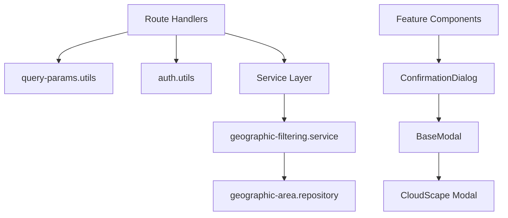

# Design Document: Technical Debt Refactoring

## Overview

This design addresses systematic technical debt through targeted refactoring of duplicated code, inline literals, and inconsistent patterns. The refactoring is organized into three main areas:

1. **Backend Constants and Utilities**: Centralize query parameter names, create reusable parsing utilities, and extract common authorization logic
2. **Shared Geographic Filtering Service**: Consolidate duplicated geographic filtering logic from 6 service files into a single shared service
3. **Frontend UI Components**: Create unified confirmation dialog and modal base components to replace inconsistent implementations

The design prioritizes backward compatibility and incremental adoption. All refactoring maintains existing behavior while establishing clearer patterns for future development.

### Design Principles

- **Single Source of Truth**: Each piece of logic or configuration exists in exactly one place
- **Backward Compatible**: Changes preserve existing API contracts and behavior
- **Incremental Adoption**: New utilities can be adopted gradually without breaking existing code
- **Type Safety**: Leverage TypeScript to catch errors at compile time
- **Testability**: Design utilities and services to be easily unit tested

## Architecture

### Backend Architecture Changes

```
backend-api/src/
├── utils/
│   ├── constants.ts (EXTENDED)
│   │   └── Add QUERY_PARAMS constant object
│   ├── query-params.utils.ts (EXTENDED)
│   │   ├── normalizeArrayParam() (EXISTS)
│   │   ├── parsePaginationParams() (NEW)
│   │   └── parseIntegerParam() (NEW)
│   └── auth.utils.ts (NEW)
│       └── extractAuthorizationContext() (NEW)
├── services/
│   └── geographic-filtering.service.ts (NEW)
│       └── getEffectiveGeographicAreaIds() (NEW)
└── routes/
    └── *.routes.ts (MODIFIED)
        └── Use new utilities instead of inline logic
```

### Frontend Architecture Changes

```
web-frontend/src/
├── components/
│   └── common/
│       ├── ConfirmationDialog.tsx (NEW)
│       │   └── Unified confirmation component
│       └── BaseModal.tsx (NEW)
│           └── Reusable modal wrapper
└── components/features/
    └── *.tsx (MODIFIED)
        └── Replace window.confirm() with ConfirmationDialog
```

### Dependency Flow



## Components and Interfaces

### Backend Components

#### 1. Query Parameter Constants

**File**: `backend-api/src/utils/constants.ts`

**Purpose**: Centralize all query parameter names to prevent typos and ensure consistency

**Interface**:
```typescript
export const QUERY_PARAMS = {
  // Pagination
  PAGE: 'page',
  LIMIT: 'limit',
  
  // Filtering
  GEOGRAPHIC_AREA_ID: 'geographicAreaId',
  DEPTH: 'depth',
  
  // Grouping and Analytics
  GROUP_BY: 'groupBy',
  START_DATE: 'startDate',
  END_DATE: 'endDate',
  TIME_PERIOD: 'timePeriod',
  GRANULARITY: 'granularity',
  
  // Sorting
  SORT_BY: 'sortBy',
  SORT_ORDER: 'sortOrder',
} as const;

// Type for query parameter keys
export type QueryParamKey = typeof QUERY_PARAMS[keyof typeof QUERY_PARAMS];
```

**Design Decisions**:
- Use `as const` to make values readonly and enable literal type inference
- Group related parameters with comments for clarity
- Export type alias for type-safe parameter access
- Standardize on "limit" instead of "pageSize" for consistency

#### 2. Pagination Parsing Utility

**File**: `backend-api/src/utils/query-params.utils.ts`

**Purpose**: Parse and validate pagination parameters consistently across all routes

**Interface**:
```typescript
export interface PaginationParams {
  page?: number;
  limit?: number;
}

export interface PaginationParseResult {
  pagination: PaginationParams;
  errors: string[];
}

/**
 * Parse pagination parameters from query string
 * @param query - Express request query object
 * @returns Parsed pagination with validation errors
 */
export function parsePaginationParams(
  query: Record<string, any>
): PaginationParseResult {
  const errors: string[] = [];
  const pagination: PaginationParams = {};
  
  // Parse page
  if (query[QUERY_PARAMS.PAGE] !== undefined) {
    const page = parseIntegerParam(query[QUERY_PARAMS.PAGE], 'page');
    if (page.error) {
      errors.push(page.error);
    } else if (page.value !== undefined) {
      if (page.value < 1) {
        errors.push('Page must be >= 1');
      } else {
        pagination.page = page.value;
      }
    }
  }
  
  // Parse limit
  if (query[QUERY_PARAMS.LIMIT] !== undefined) {
    const limit = parseIntegerParam(query[QUERY_PARAMS.LIMIT], 'limit');
    if (limit.error) {
      errors.push(limit.error);
    } else if (limit.value !== undefined) {
      if (limit.value < 1) {
        errors.push('Limit must be >= 1');
      } else if (limit.value > PAGINATION.MAX_LIMIT) {
        errors.push(`Limit must be <= ${PAGINATION.MAX_LIMIT}`);
      } else {
        pagination.limit = limit.value;
      }
    }
  }
  
  return { pagination, errors };
}

/**
 * Parse a query parameter as an integer
 * @param value - Query parameter value
 * @param paramName - Parameter name for error messages
 * @returns Parsed integer or error
 */
export function parseIntegerParam(
  value: any,
  paramName: string
): { value?: number; error?: string } {
  if (value === undefined || value === null) {
    return { value: undefined };
  }
  
  const parsed = parseInt(value as string, 10);
  if (isNaN(parsed)) {
    return { error: `${paramName} must be a valid integer` };
  }
  
  return { value: parsed };
}
```

**Design Decisions**:
- Return both parsed values and validation errors for flexible error handling
- Validate ranges (page >= 1, limit between 1 and MAX_LIMIT)
- Use QUERY_PARAMS constants for parameter names
- Separate integer parsing into reusable helper function
- Return undefined for missing parameters (not errors)

#### 3. Authorization Context Extraction

**File**: `backend-api/src/utils/auth.utils.ts`

**Purpose**: Extract authorization context from authenticated requests consistently

**Interface**:
```typescript
import type { AuthenticatedRequest } from '../types/express.types';

export interface AuthorizationContext {
  authorizedAreaIds: string[];
  hasGeographicRestrictions: boolean;
  userId: string;
  userRole: string;
}

/**
 * Extract authorization context from authenticated request
 * @param req - Authenticated Express request
 * @returns Authorization context with safe defaults
 */
export function extractAuthorizationContext(
  req: AuthenticatedRequest
): AuthorizationContext {
  return {
    authorizedAreaIds: req.user?.authorizedAreaIds || [],
    hasGeographicRestrictions: req.user?.hasGeographicRestrictions || false,
    userId: req.user?.id || '',
    userRole: req.user?.role || '',
  };
}
```

**Design Decisions**:
- Provide safe defaults for all fields (empty arrays, false, empty strings)
- Include userId and userRole for common authorization needs
- Single function that extracts all authorization-related data
- Type-safe with explicit interface

#### 4. Geographic Filtering Service

**File**: `backend-api/src/services/geographic-filtering.service.ts`

**Purpose**: Centralize geographic filtering logic that was duplicated across 6 service files

**Interface**:
```typescript
import { GeographicAreaRepository } from '../repositories/geographic-area.repository';

export class GeographicFilteringService {
  private geographicAreaRepository: GeographicAreaRepository;
  
  constructor() {
    this.geographicAreaRepository = new GeographicAreaRepository();
  }
  
  /**
   * Determine effective geographic area IDs for filtering based on:
   * 1. Explicit geographic area filter (if provided)
   * 2. User's authorized areas (if user has geographic restrictions)
   * 3. No filtering (if no explicit filter and no restrictions)
   * 
   * IMPORTANT: This method expands explicit filters to include descendants.
   * Do NOT expand descendants again during implicit filtering.
   * 
   * @param explicitGeographicAreaId - Optional explicit geographic area filter
   * @param authorizedAreaIds - User's authorized geographic area IDs (already expanded)
   * @param hasGeographicRestrictions - Whether user has geographic restrictions
   * @returns Array of area IDs to filter by, or undefined for no filtering
   * @throws Error if user lacks permission for explicit filter
   */
  async getEffectiveGeographicAreaIds(
    explicitGeographicAreaId: string | undefined,
    authorizedAreaIds: string[],
    hasGeographicRestrictions: boolean
  ): Promise<string[] | undefined> {
    // If explicit filter provided
    if (explicitGeographicAreaId) {
      // Validate user has access to this area
      if (hasGeographicRestrictions && !authorizedAreaIds.includes(explicitGeographicAreaId)) {
        throw new Error(
          'GEOGRAPHIC_AUTHORIZATION_DENIED: You do not have permission to access this geographic area'
        );
      }
      
      // Expand to include descendants
      const descendantIds = await this.geographicAreaRepository.findBatchDescendants([
        explicitGeographicAreaId,
      ]);
      const allAreaIds = [explicitGeographicAreaId, ...descendantIds];
      
      // If user has geographic restrictions, filter descendants to only include authorized areas
      // This ensures DENY rules are respected even when an explicit filter is provided
      if (hasGeographicRestrictions) {
        return allAreaIds.filter(id => authorizedAreaIds.includes(id));
      }
      
      // No restrictions - return all descendants
      return allAreaIds;
    }
    
    // No explicit filter - apply implicit filtering if user has restrictions
    if (hasGeographicRestrictions) {
      // IMPORTANT: authorizedAreaIds already has descendants expanded and DENY rules applied
      // Do NOT expand descendants again, as this would re-add denied areas
      return authorizedAreaIds;
    }
    
    // No restrictions and no explicit filter - return undefined (no filtering)
    return undefined;
  }
  
  /**
   * Variant for analytics service that accepts array of area IDs
   * @param explicitGeographicAreaIds - Optional array of explicit geographic area filters
   * @param authorizedAreaIds - User's authorized geographic area IDs
   * @param hasGeographicRestrictions - Whether user has geographic restrictions
   * @returns Array of area IDs to filter by, or undefined for no filtering
   */
  async getEffectiveGeographicAreaIdsForAnalytics(
    explicitGeographicAreaIds: string | string[] | undefined,
    authorizedAreaIds: string[],
    hasGeographicRestrictions: boolean
  ): Promise<string[] | undefined> {
    // Normalize to array
    const areaIds = explicitGeographicAreaIds
      ? Array.isArray(explicitGeographicAreaIds)
        ? explicitGeographicAreaIds
        : [explicitGeographicAreaIds]
      : undefined;
    
    // If explicit filters provided
    if (areaIds && areaIds.length > 0) {
      // Validate user has access to all areas
      if (hasGeographicRestrictions) {
        for (const areaId of areaIds) {
          if (!authorizedAreaIds.includes(areaId)) {
            throw new Error(
              'GEOGRAPHIC_AUTHORIZATION_DENIED: You do not have permission to access this geographic area'
            );
          }
        }
      }
      
      // Expand all areas to include descendants
      const descendantIds = await this.geographicAreaRepository.findBatchDescendants(areaIds);
      const allAreaIds = [...areaIds, ...descendantIds];
      
      // If user has restrictions, filter to authorized areas
      if (hasGeographicRestrictions) {
        return allAreaIds.filter(id => authorizedAreaIds.includes(id));
      }
      
      // No restrictions - return all descendants
      return allAreaIds;
    }
    
    // No explicit filter - apply implicit filtering if user has restrictions
    if (hasGeographicRestrictions) {
      return authorizedAreaIds;
    }
    
    // No restrictions and no explicit filter - return undefined
    return undefined;
  }
}
```

**Design Decisions**:
- Extract exact logic from existing service implementations
- Provide two methods: single area ID and multiple area IDs (for analytics)
- Preserve all comments explaining the complex authorization logic
- Use dependency injection pattern (repository in constructor)
- Maintain existing error messages for consistency
- Return undefined (not empty array) to indicate "no filtering"

### Frontend Components

#### 5. Confirmation Dialog Component

**File**: `web-frontend/src/components/common/ConfirmationDialog.tsx`

**Purpose**: Replace all window.confirm() calls with consistent CloudScape modal

**Interface**:
```typescript
import { Modal, Box, SpaceBetween, Button } from '@cloudscape-design/components';

export interface ConfirmationDialogProps {
  visible: boolean;
  title?: string;
  message: string;
  confirmLabel?: string;
  cancelLabel?: string;
  variant?: 'destructive' | 'normal';
  onConfirm: () => void;
  onCancel: () => void;
}

export function ConfirmationDialog({
  visible,
  title = 'Confirm Action',
  message,
  confirmLabel = 'Confirm',
  cancelLabel = 'Cancel',
  variant = 'normal',
  onConfirm,
  onCancel,
}: ConfirmationDialogProps) {
  return (
    <Modal
      visible={visible}
      onDismiss={onCancel}
      header={title}
      footer={
        <Box float="right">
          <SpaceBetween direction="horizontal" size="xs">
            <Button variant="link" onClick={onCancel}>
              {cancelLabel}
            </Button>
            <Button
              variant={variant === 'destructive' ? 'primary' : 'primary'}
              onClick={onConfirm}
            >
              {confirmLabel}
            </Button>
          </SpaceBetween>
        </Box>
      }
    >
      <Box variant="p">{message}</Box>
    </Modal>
  );
}
```

**Usage Pattern**:
```typescript
// Before (window.confirm)
const handleDelete = async (item: Item) => {
  if (window.confirm(`Are you sure you want to delete "${item.name}"?`)) {
    deleteMutation.mutate(item.id);
  }
};

// After (ConfirmationDialog)
const [confirmDelete, setConfirmDelete] = useState<Item | null>(null);

const handleDelete = (item: Item) => {
  setConfirmDelete(item);
};

const handleConfirmDelete = () => {
  if (confirmDelete) {
    deleteMutation.mutate(confirmDelete.id);
    setConfirmDelete(null);
  }
};

// In JSX
<ConfirmationDialog
  visible={confirmDelete !== null}
  title="Delete Item"
  message={`Are you sure you want to delete "${confirmDelete?.name}"?`}
  confirmLabel="Delete"
  variant="destructive"
  onConfirm={handleConfirmDelete}
  onCancel={() => setConfirmDelete(null)}
/>
```

**Design Decisions**:
- Use CloudScape Modal for consistency with design system
- Support both destructive (delete) and normal (update) variants
- Provide sensible defaults for all optional props
- Simple prop interface that covers all use cases
- Controlled component pattern (visible prop)

#### 6. Base Modal Component

**File**: `web-frontend/src/components/common/BaseModal.tsx`

**Purpose**: Provide reusable modal wrapper for custom modal implementations

**Interface**:
```typescript
import { Modal, Box, SpaceBetween, Button, ModalProps } from '@cloudscape-design/components';
import { ReactNode } from 'react';

export interface BaseModalProps {
  visible: boolean;
  onDismiss: () => void;
  header: string;
  children: ReactNode;
  footer?: ReactNode;
  size?: ModalProps.Size;
}

export function BaseModal({
  visible,
  onDismiss,
  header,
  children,
  footer,
  size = 'medium',
}: BaseModalProps) {
  const defaultFooter = (
    <Box float="right">
      <Button variant="primary" onClick={onDismiss}>
        Close
      </Button>
    </Box>
  );
  
  return (
    <Modal
      visible={visible}
      onDismiss={onDismiss}
      header={header}
      footer={footer || defaultFooter}
      size={size}
    >
      {children}
    </Modal>
  );
}
```

**Design Decisions**:
- Minimal wrapper around CloudScape Modal
- Provide default footer with Close button
- Allow custom footer for complex modals
- Support all CloudScape Modal sizes
- Keep simple to encourage adoption

## Data Models

### Query Parameter Parsing Models

```typescript
// Pagination result
interface PaginationParams {
  page?: number;
  limit?: number;
}

interface PaginationParseResult {
  pagination: PaginationParams;
  errors: string[];
}

// Integer parsing result
interface IntegerParseResult {
  value?: number;
  error?: string;
}
```

### Authorization Models

```typescript
// Authorization context extracted from request
interface AuthorizationContext {
  authorizedAreaIds: string[];
  hasGeographicRestrictions: boolean;
  userId: string;
  userRole: string;
}
```

### Geographic Filtering Models

```typescript
// Input: explicit filter, authorized areas, restriction flag
// Output: effective area IDs or undefined

// Single area variant
type GetEffectiveAreasInput = {
  explicitGeographicAreaId: string | undefined;
  authorizedAreaIds: string[];
  hasGeographicRestrictions: boolean;
};

// Multiple areas variant (analytics)
type GetEffectiveAreasForAnalyticsInput = {
  explicitGeographicAreaIds: string | string[] | undefined;
  authorizedAreaIds: string[];
  hasGeographicRestrictions: boolean;
};

type GetEffectiveAreasOutput = string[] | undefined;
```

## Correctness Properties

*A property is a characteristic or behavior that should hold true across all valid executions of a system—essentially, a formal statement about what the system should do. Properties serve as the bridge between human-readable specifications and machine-verifiable correctness guarantees.*


### Property 1: Valid Pagination Parameters Parse Correctly

*For any* valid pagination query parameters (positive integers within allowed ranges), parsing them should return the correct numeric values with no errors.

**Validates: Requirements 2.2**

### Property 2: Invalid Pagination Parameters Return Errors

*For any* invalid pagination parameters (negative numbers, non-numeric strings, out-of-range values), parsing them should return appropriate error messages and not crash.

**Validates: Requirements 2.3**

### Property 3: Authorization Context Extraction Includes All Fields

*For any* authenticated request object, extracting authorization context should return an object containing authorizedAreaIds, hasGeographicRestrictions, userId, and userRole fields.

**Validates: Requirements 3.2, 3.3**

### Property 4: Geographic Filter Validation Enforces Authorization

*For any* explicit geographic area filter and set of authorized areas, when a user has geographic restrictions and the filter is not in the authorized set, the service should throw an authorization error.

**Validates: Requirements 4.3**

### Property 5: Geographic Hierarchy Expansion Includes Descendants

*For any* geographic area with descendants, expanding the hierarchy should return a set that includes the original area and all descendant areas.

**Validates: Requirements 4.6**

### Property 6: Array Normalization Wraps Single Values

*For any* single string value, normalizing it as an array parameter should return an array containing exactly that one string.

**Validates: Requirements 8.2**

### Property 7: Array Normalization Is Idempotent

*For any* array value, normalizing it multiple times should produce the same result as normalizing it once (idempotence property).

**Validates: Requirements 8.3**

### Property 8: ConfirmationDialog Renders Custom Props

*For any* valid title, message, and button label strings, the ConfirmationDialog component should render all of them in the output.

**Validates: Requirements 5.2**

## Error Handling

### Backend Error Handling

#### Pagination Parsing Errors

**Strategy**: Return validation errors in structured format rather than throwing exceptions

**Error Cases**:
- Non-numeric values: Return error "page must be a valid integer"
- Negative values: Return error "page must be >= 1"
- Limit exceeds maximum: Return error "limit must be <= 100"
- Multiple errors: Accumulate all errors in array

**Implementation**:
```typescript
// Return errors array, let caller decide how to handle
const { pagination, errors } = parsePaginationParams(req.query);
if (errors.length > 0) {
  return res.status(400).json({
    error: 'VALIDATION_ERROR',
    message: 'Invalid pagination parameters',
    details: errors,
  });
}
```

#### Geographic Filtering Errors

**Strategy**: Throw exceptions for authorization violations (security-critical)

**Error Cases**:
- Unauthorized area access: Throw "GEOGRAPHIC_AUTHORIZATION_DENIED" error
- Invalid area ID: Let repository layer handle (existing behavior)
- Missing required parameters: Return undefined (not an error)

**Implementation**:
```typescript
// Throw for authorization violations
if (hasGeographicRestrictions && !authorizedAreaIds.includes(explicitGeographicAreaId)) {
  throw new Error('GEOGRAPHIC_AUTHORIZATION_DENIED: You do not have permission to access this geographic area');
}
```

#### Authorization Context Errors

**Strategy**: Provide safe defaults rather than throwing exceptions

**Error Cases**:
- Missing user object: Return empty arrays and false flags
- Missing specific fields: Return appropriate defaults ([], false, '')
- Never throw - always return valid AuthorizationContext

**Rationale**: Authorization middleware should ensure user exists; this utility provides defensive defaults

### Frontend Error Handling

#### Component Prop Validation

**Strategy**: Use TypeScript types for compile-time validation, provide runtime defaults

**Error Cases**:
- Missing required props: TypeScript compilation error
- Invalid prop types: TypeScript compilation error
- Missing optional props: Use sensible defaults

**Implementation**:
```typescript
// Provide defaults for optional props
export function ConfirmationDialog({
  visible,
  title = 'Confirm Action',  // Default title
  message,
  confirmLabel = 'Confirm',  // Default label
  cancelLabel = 'Cancel',    // Default label
  variant = 'normal',        // Default variant
  onConfirm,
  onCancel,
}: ConfirmationDialogProps) {
  // Component implementation
}
```

#### Modal State Management

**Strategy**: Parent component controls modal state, modal component is stateless

**Error Cases**:
- Modal opened without state: Parent must manage state
- Callback not provided: TypeScript ensures callbacks are required
- Multiple modals open: Parent's responsibility to manage

**Rationale**: Controlled component pattern gives parent full control over modal lifecycle

## Testing Strategy

### Dual Testing Approach

This refactoring requires both unit tests and property-based tests:

- **Unit tests**: Verify specific examples, edge cases, and integration points
- **Property tests**: Verify universal properties across randomized inputs

Both are necessary for comprehensive coverage. Unit tests catch concrete bugs in specific scenarios, while property tests verify general correctness across many inputs.

### Backend Testing

#### Unit Tests

**Pagination Parsing**:
- Test valid inputs: `{ page: '1', limit: '50' }` → `{ page: 1, limit: 50 }`
- Test missing inputs: `{}` → `{ page: undefined, limit: undefined }`
- Test edge cases: page=0, limit=0, limit=101
- Test non-numeric: page='abc', limit='xyz'

**Authorization Context Extraction**:
- Test with full user object
- Test with missing authorizedAreaIds
- Test with missing hasGeographicRestrictions
- Test with completely missing user object

**Geographic Filtering Service**:
- Test explicit filter with authorization
- Test explicit filter without authorization
- Test implicit filtering with restrictions
- Test no filtering without restrictions
- Test descendant expansion
- Test authorization denial

**Array Normalization**:
- Test single string: 'abc' → ['abc']
- Test array: ['abc', 'def'] → ['abc', 'def']
- Test undefined: undefined → undefined
- Test comma-separated: 'abc,def' → ['abc', 'def']

#### Property-Based Tests

**Library**: Use `fast-check` for TypeScript property-based testing

**Configuration**: Minimum 100 iterations per property test

**Property 1: Valid Pagination Parameters Parse Correctly**
```typescript
// Feature: technical-debt-refactoring, Property 1: Valid pagination parameters parse correctly
fc.assert(
  fc.property(
    fc.integer({ min: 1, max: 1000 }),
    fc.integer({ min: 1, max: 100 }),
    (page, limit) => {
      const query = { page: page.toString(), limit: limit.toString() };
      const result = parsePaginationParams(query);
      
      return result.errors.length === 0 &&
             result.pagination.page === page &&
             result.pagination.limit === limit;
    }
  ),
  { numRuns: 100 }
);
```

**Property 2: Invalid Pagination Parameters Return Errors**
```typescript
// Feature: technical-debt-refactoring, Property 2: Invalid pagination parameters return errors
fc.assert(
  fc.property(
    fc.oneof(
      fc.constant('abc'),           // Non-numeric
      fc.integer({ max: 0 }),       // Non-positive
      fc.integer({ min: 101 })      // Exceeds max limit
    ),
    (invalidValue) => {
      const query = { page: invalidValue.toString() };
      const result = parsePaginationParams(query);
      
      return result.errors.length > 0;
    }
  ),
  { numRuns: 100 }
);
```

**Property 3: Authorization Context Extraction Includes All Fields**
```typescript
// Feature: technical-debt-refactoring, Property 3: Authorization context extraction includes all fields
fc.assert(
  fc.property(
    fc.record({
      user: fc.record({
        id: fc.string(),
        role: fc.string(),
        authorizedAreaIds: fc.array(fc.string()),
        hasGeographicRestrictions: fc.boolean(),
      }),
    }),
    (req) => {
      const context = extractAuthorizationContext(req as any);
      
      return typeof context.userId === 'string' &&
             typeof context.userRole === 'string' &&
             Array.isArray(context.authorizedAreaIds) &&
             typeof context.hasGeographicRestrictions === 'boolean';
    }
  ),
  { numRuns: 100 }
);
```

**Property 6: Array Normalization Wraps Single Values**
```typescript
// Feature: technical-debt-refactoring, Property 6: Array normalization wraps single values
fc.assert(
  fc.property(
    fc.string(),
    (value) => {
      const result = normalizeArrayParam(value);
      
      return Array.isArray(result) &&
             result.length === 1 &&
             result[0] === value;
    }
  ),
  { numRuns: 100 }
);
```

**Property 7: Array Normalization Is Idempotent**
```typescript
// Feature: technical-debt-refactoring, Property 7: Array normalization is idempotent
fc.assert(
  fc.property(
    fc.array(fc.string()),
    (value) => {
      const once = normalizeArrayParam(value);
      const twice = normalizeArrayParam(once);
      
      return JSON.stringify(once) === JSON.stringify(twice);
    }
  ),
  { numRuns: 100 }
);
```

### Frontend Testing

#### Unit Tests

**ConfirmationDialog Component**:
- Test renders with custom title and message
- Test confirm callback is invoked
- Test cancel callback is invoked
- Test destructive variant styling
- Test normal variant styling
- Test default props are applied

**BaseModal Component**:
- Test renders with custom header and content
- Test custom footer is used when provided
- Test default footer is used when not provided
- Test size prop is passed through
- Test onDismiss callback is invoked

**Component Integration**:
- Test replacing window.confirm() in one component
- Verify delete mutation is called after confirmation
- Verify mutation is not called after cancellation

#### Property-Based Tests

**Library**: Use `@fast-check/vitest` for React component testing

**Property 8: ConfirmationDialog Renders Custom Props**
```typescript
// Feature: technical-debt-refactoring, Property 8: ConfirmationDialog renders custom props
fc.assert(
  fc.property(
    fc.string(),  // title
    fc.string(),  // message
    fc.string(),  // confirmLabel
    (title, message, confirmLabel) => {
      const { container } = render(
        <ConfirmationDialog
          visible={true}
          title={title}
          message={message}
          confirmLabel={confirmLabel}
          onConfirm={() => {}}
          onCancel={() => {}}
        />
      );
      
      const html = container.innerHTML;
      return html.includes(title) &&
             html.includes(message) &&
             html.includes(confirmLabel);
    }
  ),
  { numRuns: 100 }
);
```

### Integration Testing

**Route Handler Integration**:
- Test route handlers use new utilities
- Verify pagination parsing integrates with existing services
- Verify authorization context integrates with existing middleware
- Verify geographic filtering service integrates with existing repositories

**Service Layer Integration**:
- Test services use geographic filtering service
- Verify behavior is identical to previous implementation
- Test with real database queries (integration tests)

**Component Integration**:
- Test components use ConfirmationDialog
- Verify user interactions work end-to-end
- Test with React Testing Library user events

### Regression Testing

**Critical**: Run all existing tests to verify no regressions

**Test Suites to Run**:
- All backend unit tests
- All backend integration tests
- All frontend component tests
- All frontend integration tests
- End-to-end tests (if they exist)

**Success Criteria**:
- All existing tests pass
- No new test failures introduced
- Test coverage maintained or improved

## Migration Strategy

### Phase 1: Create New Utilities and Services

1. Add QUERY_PARAMS constants to constants.ts
2. Add pagination parsing utilities to query-params.utils.ts
3. Create auth.utils.ts with authorization context extraction
4. Create geographic-filtering.service.ts with shared filtering logic
5. Add unit tests for all new utilities and services
6. Add property-based tests for all new utilities

**Validation**: All new tests pass, no existing code modified yet

### Phase 2: Migrate Backend Route Handlers

1. Update one route handler at a time to use new utilities
2. Run tests after each route handler migration
3. Verify behavior is identical using integration tests
4. Update route handlers in this order (lowest risk first):
   - population.routes.ts (simple, low traffic)
   - role.routes.ts (simple, low traffic)
   - activity-category.routes.ts (simple, medium traffic)
   - activity-type.routes.ts (simple, medium traffic)
   - venue.routes.ts (complex, high traffic)
   - participant.routes.ts (complex, high traffic)
   - activity.routes.ts (complex, high traffic)
   - geographic-area.routes.ts (complex, high traffic)
   - analytics.routes.ts (most complex, high traffic)

**Validation**: All tests pass after each migration, API behavior unchanged

### Phase 3: Migrate Backend Service Layer

1. Update services to use geographic-filtering.service.ts
2. Remove duplicated getEffectiveGeographicAreaIds methods
3. Update one service at a time
4. Run tests after each service migration
5. Update services in this order:
   - population.service.ts (if applicable)
   - venue.service.ts
   - participant.service.ts
   - activity.service.ts
   - geographic-area.service.ts
   - analytics.service.ts
   - map-data.service.ts

**Validation**: All tests pass, no behavior changes

### Phase 4: Create Frontend Components

1. Create BaseModal component
2. Create ConfirmationDialog component
3. Add unit tests for both components
4. Add property-based tests for ConfirmationDialog
5. Create example usage in Storybook (if available)

**Validation**: Component tests pass, no existing code modified yet

### Phase 5: Migrate Frontend Components

1. Update one component at a time to use ConfirmationDialog
2. Test each component after migration
3. Verify user interactions work correctly
4. Update components in this order (lowest risk first):
   - PopulationList.tsx (simple, low traffic)
   - ActivityCategoryList.tsx (simple, low traffic)
   - ActivityTypeList.tsx (simple, low traffic)
   - ParticipantRoleList.tsx (simple, low traffic)
   - GeographicAuthorizationManager.tsx (medium complexity)
   - UserFormWithAuthorization.tsx (medium complexity)
   - VenueList.tsx (complex, high traffic)
   - ParticipantList.tsx (complex, high traffic)
   - ActivityList.tsx (complex, high traffic)
   - GeographicAreaList.tsx (complex, high traffic)
   - VenueDetail.tsx (complex, high traffic)
   - ParticipantDetail.tsx (complex, high traffic)
   - GeographicAreaDetail.tsx (complex, high traffic)
   - ActivityDetail.tsx (most complex, high traffic)

**Validation**: All component tests pass, user interactions work correctly

### Phase 6: Update Analytics Endpoints

1. Change "pageSize" parameter to "limit" in analytics routes
2. Update API documentation
3. Update frontend code that calls analytics endpoints
4. Add deprecation warning for "pageSize" parameter (optional)
5. Run integration tests

**Validation**: Analytics endpoints work with "limit" parameter

### Phase 7: Documentation and Cleanup

1. Update API documentation with new parameter names
2. Document new utilities and services
3. Add code comments explaining usage patterns
4. Update developer guide with refactoring patterns
5. Remove any deprecated code (if applicable)

**Validation**: Documentation is complete and accurate

## Rollback Plan

### If Issues Arise During Migration

**Backend Rollback**:
- Each route handler migration is independent
- Can rollback individual route handlers by reverting commits
- Services can continue using old logic until all routes are migrated
- Geographic filtering service is additive (doesn't break existing code)

**Frontend Rollback**:
- Each component migration is independent
- Can rollback individual components by reverting commits
- window.confirm() still works if ConfirmationDialog has issues
- BaseModal is optional (existing modals continue working)

**Critical Issues**:
- If geographic filtering service has bugs, rollback all service migrations
- If pagination parsing has bugs, rollback all route handler migrations
- If ConfirmationDialog has bugs, rollback all component migrations

### Testing Before Deployment

**Staging Environment**:
- Deploy to staging after each phase
- Run full test suite in staging
- Perform manual testing of affected features
- Monitor for errors and performance issues

**Production Deployment**:
- Deploy during low-traffic period
- Monitor error rates and performance metrics
- Have rollback plan ready
- Deploy in phases if possible (feature flags)

## Performance Considerations

### Backend Performance

**Geographic Filtering Service**:
- No performance impact (same logic as before)
- Potential improvement: cache descendant lookups
- Repository layer already handles database optimization

**Pagination Parsing**:
- Negligible performance impact (simple integer parsing)
- Slightly faster than repeated inline parsing

**Authorization Context Extraction**:
- Negligible performance impact (simple object access)
- No additional database queries

### Frontend Performance

**ConfirmationDialog Component**:
- Slightly heavier than window.confirm() (React rendering)
- Negligible impact on user experience
- Better UX with consistent styling

**BaseModal Component**:
- No performance impact (thin wrapper)
- Same performance as direct CloudScape Modal usage

### Memory Considerations

**Backend**:
- Geographic filtering service is singleton (one instance)
- No additional memory overhead
- Utilities are stateless functions

**Frontend**:
- Each ConfirmationDialog instance adds minimal memory
- Modal state managed by parent component
- No memory leaks (proper cleanup in React)

## Security Considerations

### Authorization Validation

**Critical**: Geographic filtering service must maintain existing authorization logic

**Security Requirements**:
- Validate explicit filters against authorized areas
- Respect DENY rules in authorization
- Never expose unauthorized geographic areas
- Throw errors for authorization violations (don't silently fail)

**Testing**:
- Test with restricted users
- Test with unrestricted users
- Test authorization denial scenarios
- Test DENY rule enforcement

### Input Validation

**Pagination Parameters**:
- Validate ranges to prevent resource exhaustion
- Reject negative values
- Enforce maximum limit (100)
- Sanitize input before parsing

**Query Parameters**:
- Use constants to prevent injection
- Validate all user input
- Return structured errors (don't expose internals)

### Frontend Security

**ConfirmationDialog**:
- Sanitize message content (prevent XSS)
- Use React's built-in XSS protection
- Don't render raw HTML in messages

**Modal Components**:
- Proper event handling (prevent event bubbling issues)
- Accessible (keyboard navigation, screen readers)
- Focus management (trap focus in modal)

## Accessibility Considerations

### Frontend Components

**ConfirmationDialog**:
- Use CloudScape Modal (already accessible)
- Proper ARIA labels
- Keyboard navigation (Tab, Enter, Escape)
- Focus management (focus confirm button on open)
- Screen reader announcements

**BaseModal**:
- Inherit CloudScape Modal accessibility
- Proper heading hierarchy
- Focus trap within modal
- Escape key to close

**Migration Benefits**:
- window.confirm() has poor accessibility
- CloudScape Modal is WCAG 2.1 AA compliant
- Better keyboard navigation
- Better screen reader support

## Monitoring and Observability

### Backend Monitoring

**Metrics to Track**:
- Error rates in pagination parsing
- Authorization denial rates
- Geographic filtering performance
- API response times

**Logging**:
- Log authorization denials (security audit)
- Log validation errors (debugging)
- Log geographic filtering decisions (debugging)

### Frontend Monitoring

**Metrics to Track**:
- ConfirmationDialog usage rates
- Confirmation vs cancellation rates
- Modal interaction errors

**User Experience**:
- Monitor for user confusion
- Track time to confirm/cancel
- Gather feedback on new dialogs

## Future Enhancements

### Backend

**Query Parameter Validation**:
- Create comprehensive validation middleware
- Centralize all query parameter parsing
- Add OpenAPI schema validation

**Geographic Filtering**:
- Add caching for descendant lookups
- Optimize batch operations
- Add performance monitoring

**Constants Management**:
- Consider code generation for constants
- Sync constants between frontend and backend
- Add validation for constant usage

### Frontend

**Component Library**:
- Add more reusable modal patterns
- Create modal composition utilities
- Add animation and transitions

**Confirmation Patterns**:
- Add "Don't ask again" checkbox
- Add confirmation with input (type name to confirm)
- Add multi-step confirmations

**Accessibility**:
- Add keyboard shortcuts
- Improve screen reader announcements
- Add high contrast mode support
